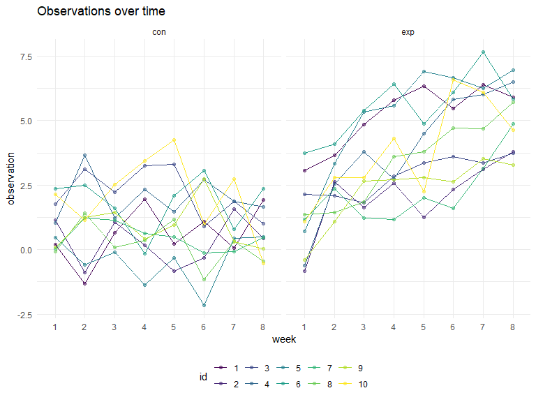

p8105\_hw5\_kq2127
================
Kristal Quispe
11/6/2019

# Problem 1

``` r
set.seed(10)

iris_with_missing = iris %>% 
  map_df(~replace(.x, sample(1:150, 20), NA)) %>%
  mutate(Species = as.character(Species))
```

Writting the Function

``` r
replace_na = function(x) {
  if (is.numeric(x)) {
    x[is.na(x)] = round(mean(x, na.rm = TRUE),1)
    x }
  else if (is.character(x)) {
    x[is.na(x)] = "virginica"
    x
  }
}
```

Testing the
    function

``` r
replace_na(iris_with_missing[[1]])
```

    ##   [1] 5.1 4.9 4.7 4.6 5.0 5.4 5.8 5.0 4.4 4.9 5.4 4.8 5.8 4.3 5.8 5.7 5.4
    ##  [18] 5.1 5.7 5.1 5.4 5.1 4.6 5.8 4.8 5.0 5.0 5.2 5.8 4.7 4.8 5.4 5.2 5.5
    ##  [35] 4.9 5.0 5.5 4.9 4.4 5.1 5.0 4.5 4.4 5.0 5.1 4.8 5.1 4.6 5.3 5.0 7.0
    ##  [52] 6.4 6.9 5.5 6.5 5.7 6.3 4.9 6.6 5.2 5.0 5.9 6.0 6.1 5.6 6.7 5.6 5.8
    ##  [69] 6.2 5.6 5.9 5.8 6.3 5.8 6.4 6.6 6.8 6.7 6.0 5.7 5.5 5.8 5.8 6.0 5.4
    ##  [86] 5.8 6.7 5.8 5.6 5.5 5.5 5.8 5.8 5.0 5.8 5.7 5.7 6.2 5.1 5.7 6.3 5.8
    ## [103] 7.1 6.3 6.5 7.6 4.9 7.3 6.7 5.8 6.5 5.8 6.8 5.7 5.8 6.4 6.5 7.7 7.7
    ## [120] 6.0 5.8 5.6 7.7 6.3 6.7 7.2 6.2 6.1 6.4 7.2 7.4 7.9 6.4 5.8 6.1 5.8
    ## [137] 5.8 6.4 6.0 6.9 6.7 6.9 5.8 6.8 6.7 6.7 6.3 6.5 5.8 5.9

``` r
replace_na(iris_with_missing[[2]])
```

    ##   [1] 3.5 3.0 3.2 3.1 3.6 3.9 3.4 3.4 2.9 3.1 3.1 3.4 3.1 3.0 4.0 4.4 3.9
    ##  [18] 3.5 3.8 3.8 3.4 3.7 3.6 3.3 3.4 3.0 3.4 3.5 3.4 3.2 3.1 3.1 3.1 4.2
    ##  [35] 3.1 3.2 3.5 3.6 3.0 3.4 3.5 3.1 3.2 3.5 3.8 3.0 3.8 3.2 3.7 3.1 3.1
    ##  [52] 3.2 3.1 2.3 2.8 2.8 3.3 2.4 2.9 2.7 2.0 3.0 2.2 2.9 2.9 3.1 3.0 3.1
    ##  [69] 2.2 2.5 3.2 2.8 2.5 2.8 2.9 3.0 2.8 3.1 3.1 2.6 2.4 2.4 2.7 2.7 3.0
    ##  [86] 3.4 3.1 3.1 3.0 2.5 3.1 3.1 3.1 2.3 2.7 3.0 2.9 2.9 2.5 2.8 3.1 2.7
    ## [103] 3.0 2.9 3.1 3.0 2.5 2.9 3.1 3.6 3.2 2.7 3.0 3.1 2.8 3.2 3.0 3.8 2.6
    ## [120] 2.2 3.2 3.1 2.8 2.7 3.3 3.2 2.8 3.0 2.8 3.0 2.8 3.8 2.8 2.8 3.1 3.0
    ## [137] 3.4 3.1 3.0 3.1 3.1 3.1 2.7 3.2 3.3 3.0 2.5 3.0 3.4 3.0

``` r
replace_na(iris_with_missing[[3]])
```

    ##   [1] 1.4 1.4 1.3 1.5 1.4 1.7 1.4 1.5 1.4 3.8 1.5 1.6 1.4 3.8 3.8 1.5 1.3
    ##  [18] 1.4 1.7 1.5 1.7 1.5 1.0 3.8 1.9 3.8 1.6 1.5 1.4 1.6 3.8 1.5 1.5 1.4
    ##  [35] 3.8 1.2 1.3 1.4 1.3 1.5 1.3 1.3 1.3 1.6 1.9 1.4 1.6 3.8 1.5 1.4 4.7
    ##  [52] 4.5 4.9 4.0 4.6 4.5 4.7 3.8 4.6 3.9 3.8 4.2 4.0 4.7 3.6 4.4 4.5 4.1
    ##  [69] 4.5 3.9 4.8 4.0 4.9 3.8 4.3 4.4 4.8 5.0 4.5 3.5 3.8 3.7 3.9 5.1 4.5
    ##  [86] 4.5 4.7 4.4 3.8 4.0 4.4 4.6 4.0 3.3 4.2 4.2 4.2 4.3 3.0 4.1 3.8 5.1
    ## [103] 5.9 5.6 5.8 6.6 4.5 6.3 3.8 3.8 5.1 5.3 5.5 5.0 5.1 5.3 3.8 6.7 6.9
    ## [120] 5.0 5.7 4.9 6.7 4.9 5.7 6.0 4.8 4.9 5.6 5.8 6.1 3.8 3.8 5.1 5.6 6.1
    ## [137] 5.6 5.5 4.8 5.4 5.6 5.1 5.1 3.8 3.8 5.2 5.0 5.2 5.4 5.1

``` r
replace_na(iris_with_missing[[4]])
```

    ##   [1] 0.2 0.2 0.2 1.2 0.2 0.4 0.3 0.2 0.2 0.1 0.2 0.2 0.1 0.1 0.2 0.4 0.4
    ##  [18] 1.2 0.3 1.2 0.2 0.4 0.2 0.5 0.2 0.2 0.4 0.2 0.2 0.2 0.2 0.4 0.1 0.2
    ##  [35] 0.2 0.2 0.2 0.1 1.2 0.2 0.3 1.2 0.2 0.6 0.4 0.3 0.2 0.2 0.2 0.2 1.4
    ##  [52] 1.5 1.5 1.3 1.5 1.3 1.6 1.0 1.3 1.4 1.0 1.5 1.2 1.4 1.3 1.4 1.5 1.0
    ##  [69] 1.5 1.1 1.8 1.3 1.5 1.2 1.3 1.4 1.4 1.2 1.2 1.0 1.1 1.0 1.2 1.6 1.5
    ##  [86] 1.6 1.2 1.3 1.2 1.2 1.2 1.2 1.2 1.2 1.3 1.2 1.3 1.3 1.2 1.3 2.5 1.9
    ## [103] 2.1 1.8 2.2 2.1 1.7 1.8 1.8 2.5 2.0 1.9 2.1 2.0 2.4 2.3 1.8 1.2 2.3
    ## [120] 1.5 1.2 2.0 2.0 1.8 2.1 1.8 1.8 1.8 2.1 1.6 1.2 2.0 2.2 1.5 1.4 2.3
    ## [137] 1.2 1.2 1.8 2.1 2.4 2.3 1.9 2.3 2.5 2.3 1.9 2.0 2.3 1.8

``` r
replace_na(iris_with_missing[[5]])
```

    ##   [1] "setosa"     "setosa"     "setosa"     "setosa"     "setosa"    
    ##   [6] "setosa"     "setosa"     "setosa"     "setosa"     "setosa"    
    ##  [11] "setosa"     "setosa"     "setosa"     "setosa"     "setosa"    
    ##  [16] "setosa"     "setosa"     "setosa"     "setosa"     "setosa"    
    ##  [21] "setosa"     "virginica"  "setosa"     "setosa"     "virginica" 
    ##  [26] "setosa"     "virginica"  "setosa"     "setosa"     "setosa"    
    ##  [31] "setosa"     "setosa"     "setosa"     "setosa"     "setosa"    
    ##  [36] "setosa"     "setosa"     "setosa"     "setosa"     "setosa"    
    ##  [41] "setosa"     "virginica"  "setosa"     "setosa"     "setosa"    
    ##  [46] "virginica"  "setosa"     "setosa"     "setosa"     "setosa"    
    ##  [51] "virginica"  "versicolor" "versicolor" "versicolor" "versicolor"
    ##  [56] "versicolor" "virginica"  "versicolor" "virginica"  "versicolor"
    ##  [61] "versicolor" "versicolor" "versicolor" "versicolor" "versicolor"
    ##  [66] "versicolor" "versicolor" "versicolor" "versicolor" "versicolor"
    ##  [71] "versicolor" "virginica"  "versicolor" "versicolor" "versicolor"
    ##  [76] "versicolor" "versicolor" "versicolor" "versicolor" "virginica" 
    ##  [81] "versicolor" "versicolor" "versicolor" "versicolor" "versicolor"
    ##  [86] "versicolor" "versicolor" "versicolor" "versicolor" "versicolor"
    ##  [91] "versicolor" "versicolor" "versicolor" "virginica"  "versicolor"
    ##  [96] "versicolor" "versicolor" "versicolor" "versicolor" "virginica" 
    ## [101] "virginica"  "virginica"  "virginica"  "virginica"  "virginica" 
    ## [106] "virginica"  "virginica"  "virginica"  "virginica"  "virginica" 
    ## [111] "virginica"  "virginica"  "virginica"  "virginica"  "virginica" 
    ## [116] "virginica"  "virginica"  "virginica"  "virginica"  "virginica" 
    ## [121] "virginica"  "virginica"  "virginica"  "virginica"  "virginica" 
    ## [126] "virginica"  "virginica"  "virginica"  "virginica"  "virginica" 
    ## [131] "virginica"  "virginica"  "virginica"  "virginica"  "virginica" 
    ## [136] "virginica"  "virginica"  "virginica"  "virginica"  "virginica" 
    ## [141] "virginica"  "virginica"  "virginica"  "virginica"  "virginica" 
    ## [146] "virginica"  "virginica"  "virginica"  "virginica"  "virginica"

Applying the function and mapping

``` r
output = map_dfr(iris_with_missing, replace_na)

output
```

    ## # A tibble: 150 x 5
    ##    Sepal.Length Sepal.Width Petal.Length Petal.Width Species
    ##           <dbl>       <dbl>        <dbl>       <dbl> <chr>  
    ##  1          5.1         3.5          1.4         0.2 setosa 
    ##  2          4.9         3            1.4         0.2 setosa 
    ##  3          4.7         3.2          1.3         0.2 setosa 
    ##  4          4.6         3.1          1.5         1.2 setosa 
    ##  5          5           3.6          1.4         0.2 setosa 
    ##  6          5.4         3.9          1.7         0.4 setosa 
    ##  7          5.8         3.4          1.4         0.3 setosa 
    ##  8          5           3.4          1.5         0.2 setosa 
    ##  9          4.4         2.9          1.4         0.2 setosa 
    ## 10          4.9         3.1          3.8         0.1 setosa 
    ## # ... with 140 more rows

# Problem 2

``` r
pb2_df = 
  list.files(
    path = "./data/",
    pattern = "*.csv",
    full.names = TRUE) %>% 
  map_df(read_csv, .id = "input") %>% 
  rename(id = input) %>% 
  mutate(
    id = as.numeric(id),
    arm = ifelse(id <= 10, "con", "exp"),
    id = recode(id,
       '11' = 1,
       '12' = 2,
       '13' = 3,
       '14' = 4,
       '15' = 5,
       '16' = 6,
       '17' = 7,
       '18' = 8,
       '19' = 9,
       '20' = 10)) %>% 
  pivot_longer(
    week_1:week_8,
    names_to = "week",
    names_prefix = "week_",
    values_to = "observation") %>%
  select(id, arm, everything())
```

    ## Parsed with column specification:
    ## cols(
    ##   week_1 = col_double(),
    ##   week_2 = col_double(),
    ##   week_3 = col_double(),
    ##   week_4 = col_double(),
    ##   week_5 = col_double(),
    ##   week_6 = col_double(),
    ##   week_7 = col_double(),
    ##   week_8 = col_double()
    ## )
    ## Parsed with column specification:
    ## cols(
    ##   week_1 = col_double(),
    ##   week_2 = col_double(),
    ##   week_3 = col_double(),
    ##   week_4 = col_double(),
    ##   week_5 = col_double(),
    ##   week_6 = col_double(),
    ##   week_7 = col_double(),
    ##   week_8 = col_double()
    ## )
    ## Parsed with column specification:
    ## cols(
    ##   week_1 = col_double(),
    ##   week_2 = col_double(),
    ##   week_3 = col_double(),
    ##   week_4 = col_double(),
    ##   week_5 = col_double(),
    ##   week_6 = col_double(),
    ##   week_7 = col_double(),
    ##   week_8 = col_double()
    ## )
    ## Parsed with column specification:
    ## cols(
    ##   week_1 = col_double(),
    ##   week_2 = col_double(),
    ##   week_3 = col_double(),
    ##   week_4 = col_double(),
    ##   week_5 = col_double(),
    ##   week_6 = col_double(),
    ##   week_7 = col_double(),
    ##   week_8 = col_double()
    ## )
    ## Parsed with column specification:
    ## cols(
    ##   week_1 = col_double(),
    ##   week_2 = col_double(),
    ##   week_3 = col_double(),
    ##   week_4 = col_double(),
    ##   week_5 = col_double(),
    ##   week_6 = col_double(),
    ##   week_7 = col_double(),
    ##   week_8 = col_double()
    ## )
    ## Parsed with column specification:
    ## cols(
    ##   week_1 = col_double(),
    ##   week_2 = col_double(),
    ##   week_3 = col_double(),
    ##   week_4 = col_double(),
    ##   week_5 = col_double(),
    ##   week_6 = col_double(),
    ##   week_7 = col_double(),
    ##   week_8 = col_double()
    ## )
    ## Parsed with column specification:
    ## cols(
    ##   week_1 = col_double(),
    ##   week_2 = col_double(),
    ##   week_3 = col_double(),
    ##   week_4 = col_double(),
    ##   week_5 = col_double(),
    ##   week_6 = col_double(),
    ##   week_7 = col_double(),
    ##   week_8 = col_double()
    ## )
    ## Parsed with column specification:
    ## cols(
    ##   week_1 = col_double(),
    ##   week_2 = col_double(),
    ##   week_3 = col_double(),
    ##   week_4 = col_double(),
    ##   week_5 = col_double(),
    ##   week_6 = col_double(),
    ##   week_7 = col_double(),
    ##   week_8 = col_double()
    ## )
    ## Parsed with column specification:
    ## cols(
    ##   week_1 = col_double(),
    ##   week_2 = col_double(),
    ##   week_3 = col_double(),
    ##   week_4 = col_double(),
    ##   week_5 = col_double(),
    ##   week_6 = col_double(),
    ##   week_7 = col_double(),
    ##   week_8 = col_double()
    ## )
    ## Parsed with column specification:
    ## cols(
    ##   week_1 = col_double(),
    ##   week_2 = col_double(),
    ##   week_3 = col_double(),
    ##   week_4 = col_double(),
    ##   week_5 = col_double(),
    ##   week_6 = col_double(),
    ##   week_7 = col_double(),
    ##   week_8 = col_double()
    ## )
    ## Parsed with column specification:
    ## cols(
    ##   week_1 = col_double(),
    ##   week_2 = col_double(),
    ##   week_3 = col_double(),
    ##   week_4 = col_double(),
    ##   week_5 = col_double(),
    ##   week_6 = col_double(),
    ##   week_7 = col_double(),
    ##   week_8 = col_double()
    ## )
    ## Parsed with column specification:
    ## cols(
    ##   week_1 = col_double(),
    ##   week_2 = col_double(),
    ##   week_3 = col_double(),
    ##   week_4 = col_double(),
    ##   week_5 = col_double(),
    ##   week_6 = col_double(),
    ##   week_7 = col_double(),
    ##   week_8 = col_double()
    ## )
    ## Parsed with column specification:
    ## cols(
    ##   week_1 = col_double(),
    ##   week_2 = col_double(),
    ##   week_3 = col_double(),
    ##   week_4 = col_double(),
    ##   week_5 = col_double(),
    ##   week_6 = col_double(),
    ##   week_7 = col_double(),
    ##   week_8 = col_double()
    ## )
    ## Parsed with column specification:
    ## cols(
    ##   week_1 = col_double(),
    ##   week_2 = col_double(),
    ##   week_3 = col_double(),
    ##   week_4 = col_double(),
    ##   week_5 = col_double(),
    ##   week_6 = col_double(),
    ##   week_7 = col_double(),
    ##   week_8 = col_double()
    ## )
    ## Parsed with column specification:
    ## cols(
    ##   week_1 = col_double(),
    ##   week_2 = col_double(),
    ##   week_3 = col_double(),
    ##   week_4 = col_double(),
    ##   week_5 = col_double(),
    ##   week_6 = col_double(),
    ##   week_7 = col_double(),
    ##   week_8 = col_double()
    ## )
    ## Parsed with column specification:
    ## cols(
    ##   week_1 = col_double(),
    ##   week_2 = col_double(),
    ##   week_3 = col_double(),
    ##   week_4 = col_double(),
    ##   week_5 = col_double(),
    ##   week_6 = col_double(),
    ##   week_7 = col_double(),
    ##   week_8 = col_double()
    ## )
    ## Parsed with column specification:
    ## cols(
    ##   week_1 = col_double(),
    ##   week_2 = col_double(),
    ##   week_3 = col_double(),
    ##   week_4 = col_double(),
    ##   week_5 = col_double(),
    ##   week_6 = col_double(),
    ##   week_7 = col_double(),
    ##   week_8 = col_double()
    ## )
    ## Parsed with column specification:
    ## cols(
    ##   week_1 = col_double(),
    ##   week_2 = col_double(),
    ##   week_3 = col_double(),
    ##   week_4 = col_double(),
    ##   week_5 = col_double(),
    ##   week_6 = col_double(),
    ##   week_7 = col_double(),
    ##   week_8 = col_double()
    ## )
    ## Parsed with column specification:
    ## cols(
    ##   week_1 = col_double(),
    ##   week_2 = col_double(),
    ##   week_3 = col_double(),
    ##   week_4 = col_double(),
    ##   week_5 = col_double(),
    ##   week_6 = col_double(),
    ##   week_7 = col_double(),
    ##   week_8 = col_double()
    ## )
    ## Parsed with column specification:
    ## cols(
    ##   week_1 = col_double(),
    ##   week_2 = col_double(),
    ##   week_3 = col_double(),
    ##   week_4 = col_double(),
    ##   week_5 = col_double(),
    ##   week_6 = col_double(),
    ##   week_7 = col_double(),
    ##   week_8 = col_double()
    ## )

``` r
pb2_df %>% 
  mutate (id = as.factor(id)) %>% 
  ggplot(aes(x = week, y = observation, color = id, group = id)) + 
  geom_point(alpha =.5) +
  geom_line() +
  facet_grid(~arm) +
  ggtitle("Observations over time") 
```


Over time, the control arm tends to have an overall constant trend:
there are dips and rises in observation values over time that mostly
average out. On the other hand the experimental arm tends to increase in
its observations values over time.

# Problem 3

``` r
set.seed(1)

sim_regression = function(n = 30, beta0 = 2, beta1) {
  
  sim_data = tibble(
    x = rnorm(n = 30),
    y = 2 + beta1 * x + rnorm(n = 30, 0, 50)
  )
  
  ls_fit = lm(y ~ x, data = sim_data)
  
  
   pb3_df = tibble(
    beta1_hat = broom::tidy(ls_fit)[2, 2] %>% pull(),
    p = broom::tidy(ls_fit)[2, 5] %>% pull ()
  )
print(pb3_df)
}
```

Testting the function

``` r
sim_regression(beta1 = 0)
```

    ## # A tibble: 1 x 2
    ##   beta1_hat     p
    ##       <dbl> <dbl>
    ## 1      2.09 0.798

Generating 100 datasets

``` r
output_2 = 
  rerun(100, sim_regression(beta1 = 0 )) %>% 
  bind_rows()
```

    ## # A tibble: 1 x 2
    ##   beta1_hat     p
    ##       <dbl> <dbl>
    ## 1    0.0458 0.996
    ## # A tibble: 1 x 2
    ##   beta1_hat     p
    ##       <dbl> <dbl>
    ## 1     -15.2 0.155
    ## # A tibble: 1 x 2
    ##   beta1_hat     p
    ##       <dbl> <dbl>
    ## 1     -3.21 0.718
    ## # A tibble: 1 x 2
    ##   beta1_hat     p
    ##       <dbl> <dbl>
    ## 1     -3.64 0.730
    ## # A tibble: 1 x 2
    ##   beta1_hat     p
    ##       <dbl> <dbl>
    ## 1      12.1 0.243
    ## # A tibble: 1 x 2
    ##   beta1_hat     p
    ##       <dbl> <dbl>
    ## 1     -8.37 0.322
    ## # A tibble: 1 x 2
    ##   beta1_hat     p
    ##       <dbl> <dbl>
    ## 1      7.72 0.366
    ## # A tibble: 1 x 2
    ##   beta1_hat     p
    ##       <dbl> <dbl>
    ## 1      5.70 0.377
    ## # A tibble: 1 x 2
    ##   beta1_hat     p
    ##       <dbl> <dbl>
    ## 1      16.7 0.131
    ## # A tibble: 1 x 2
    ##   beta1_hat     p
    ##       <dbl> <dbl>
    ## 1      12.2 0.164
    ## # A tibble: 1 x 2
    ##   beta1_hat      p
    ##       <dbl>  <dbl>
    ## 1      18.9 0.0858
    ## # A tibble: 1 x 2
    ##   beta1_hat     p
    ##       <dbl> <dbl>
    ## 1      10.9 0.250
    ## # A tibble: 1 x 2
    ##   beta1_hat     p
    ##       <dbl> <dbl>
    ## 1     -6.51 0.559
    ## # A tibble: 1 x 2
    ##   beta1_hat     p
    ##       <dbl> <dbl>
    ## 1     -6.01 0.421
    ## # A tibble: 1 x 2
    ##   beta1_hat     p
    ##       <dbl> <dbl>
    ## 1     -6.54 0.528
    ## # A tibble: 1 x 2
    ##   beta1_hat     p
    ##       <dbl> <dbl>
    ## 1     0.489 0.950
    ## # A tibble: 1 x 2
    ##   beta1_hat     p
    ##       <dbl> <dbl>
    ## 1     -13.7 0.324
    ## # A tibble: 1 x 2
    ##   beta1_hat     p
    ##       <dbl> <dbl>
    ## 1      3.59 0.730
    ## # A tibble: 1 x 2
    ##   beta1_hat     p
    ##       <dbl> <dbl>
    ## 1      5.44 0.607
    ## # A tibble: 1 x 2
    ##   beta1_hat     p
    ##       <dbl> <dbl>
    ## 1      5.22 0.555
    ## # A tibble: 1 x 2
    ##   beta1_hat     p
    ##       <dbl> <dbl>
    ## 1      1.01 0.917
    ## # A tibble: 1 x 2
    ##   beta1_hat     p
    ##       <dbl> <dbl>
    ## 1     0.304 0.976
    ## # A tibble: 1 x 2
    ##   beta1_hat     p
    ##       <dbl> <dbl>
    ## 1      2.39 0.815
    ## # A tibble: 1 x 2
    ##   beta1_hat     p
    ##       <dbl> <dbl>
    ## 1      9.16 0.243
    ## # A tibble: 1 x 2
    ##   beta1_hat     p
    ##       <dbl> <dbl>
    ## 1    -0.162 0.987
    ## # A tibble: 1 x 2
    ##   beta1_hat     p
    ##       <dbl> <dbl>
    ## 1      4.44 0.645
    ## # A tibble: 1 x 2
    ##   beta1_hat     p
    ##       <dbl> <dbl>
    ## 1    0.0999 0.990
    ## # A tibble: 1 x 2
    ##   beta1_hat     p
    ##       <dbl> <dbl>
    ## 1      7.16 0.478
    ## # A tibble: 1 x 2
    ##   beta1_hat     p
    ##       <dbl> <dbl>
    ## 1     -7.34 0.504
    ## # A tibble: 1 x 2
    ##   beta1_hat     p
    ##       <dbl> <dbl>
    ## 1     -6.21 0.679
    ## # A tibble: 1 x 2
    ##   beta1_hat     p
    ##       <dbl> <dbl>
    ## 1      1.82 0.833
    ## # A tibble: 1 x 2
    ##   beta1_hat     p
    ##       <dbl> <dbl>
    ## 1     -13.5 0.172
    ## # A tibble: 1 x 2
    ##   beta1_hat     p
    ##       <dbl> <dbl>
    ## 1      9.59 0.309
    ## # A tibble: 1 x 2
    ##   beta1_hat     p
    ##       <dbl> <dbl>
    ## 1      8.72 0.328
    ## # A tibble: 1 x 2
    ##   beta1_hat     p
    ##       <dbl> <dbl>
    ## 1     0.295 0.976
    ## # A tibble: 1 x 2
    ##   beta1_hat     p
    ##       <dbl> <dbl>
    ## 1     -12.3 0.232
    ## # A tibble: 1 x 2
    ##   beta1_hat     p
    ##       <dbl> <dbl>
    ## 1     -2.06 0.864
    ## # A tibble: 1 x 2
    ##   beta1_hat     p
    ##       <dbl> <dbl>
    ## 1     -15.2 0.180
    ## # A tibble: 1 x 2
    ##   beta1_hat     p
    ##       <dbl> <dbl>
    ## 1     -8.83 0.324
    ## # A tibble: 1 x 2
    ##   beta1_hat     p
    ##       <dbl> <dbl>
    ## 1      10.9 0.271
    ## # A tibble: 1 x 2
    ##   beta1_hat      p
    ##       <dbl>  <dbl>
    ## 1      18.2 0.0146
    ## # A tibble: 1 x 2
    ##   beta1_hat     p
    ##       <dbl> <dbl>
    ## 1     -11.3 0.110
    ## # A tibble: 1 x 2
    ##   beta1_hat     p
    ##       <dbl> <dbl>
    ## 1      9.31 0.179
    ## # A tibble: 1 x 2
    ##   beta1_hat     p
    ##       <dbl> <dbl>
    ## 1      1.38 0.893
    ## # A tibble: 1 x 2
    ##   beta1_hat      p
    ##       <dbl>  <dbl>
    ## 1      14.8 0.0135
    ## # A tibble: 1 x 2
    ##   beta1_hat     p
    ##       <dbl> <dbl>
    ## 1     -11.9 0.245
    ## # A tibble: 1 x 2
    ##   beta1_hat     p
    ##       <dbl> <dbl>
    ## 1      5.60 0.581
    ## # A tibble: 1 x 2
    ##   beta1_hat     p
    ##       <dbl> <dbl>
    ## 1     -9.89 0.279
    ## # A tibble: 1 x 2
    ##   beta1_hat     p
    ##       <dbl> <dbl>
    ## 1     -16.6 0.130
    ## # A tibble: 1 x 2
    ##   beta1_hat     p
    ##       <dbl> <dbl>
    ## 1      7.61 0.322
    ## # A tibble: 1 x 2
    ##   beta1_hat     p
    ##       <dbl> <dbl>
    ## 1     -7.67 0.380
    ## # A tibble: 1 x 2
    ##   beta1_hat     p
    ##       <dbl> <dbl>
    ## 1     -7.60 0.328
    ## # A tibble: 1 x 2
    ##   beta1_hat     p
    ##       <dbl> <dbl>
    ## 1      5.30 0.631
    ## # A tibble: 1 x 2
    ##   beta1_hat     p
    ##       <dbl> <dbl>
    ## 1     0.995 0.930
    ## # A tibble: 1 x 2
    ##   beta1_hat     p
    ##       <dbl> <dbl>
    ## 1     -6.78 0.480
    ## # A tibble: 1 x 2
    ##   beta1_hat     p
    ##       <dbl> <dbl>
    ## 1      4.57 0.619
    ## # A tibble: 1 x 2
    ##   beta1_hat     p
    ##       <dbl> <dbl>
    ## 1      18.8 0.216
    ## # A tibble: 1 x 2
    ##   beta1_hat     p
    ##       <dbl> <dbl>
    ## 1     -4.73 0.666
    ## # A tibble: 1 x 2
    ##   beta1_hat     p
    ##       <dbl> <dbl>
    ## 1     -7.19 0.466
    ## # A tibble: 1 x 2
    ##   beta1_hat     p
    ##       <dbl> <dbl>
    ## 1     -5.07 0.613
    ## # A tibble: 1 x 2
    ##   beta1_hat     p
    ##       <dbl> <dbl>
    ## 1      14.8 0.143
    ## # A tibble: 1 x 2
    ##   beta1_hat     p
    ##       <dbl> <dbl>
    ## 1     -6.24 0.543
    ## # A tibble: 1 x 2
    ##   beta1_hat     p
    ##       <dbl> <dbl>
    ## 1      6.99 0.624
    ## # A tibble: 1 x 2
    ##   beta1_hat     p
    ##       <dbl> <dbl>
    ## 1      4.57 0.668
    ## # A tibble: 1 x 2
    ##   beta1_hat     p
    ##       <dbl> <dbl>
    ## 1     -9.90 0.206
    ## # A tibble: 1 x 2
    ##   beta1_hat     p
    ##       <dbl> <dbl>
    ## 1      4.28 0.654
    ## # A tibble: 1 x 2
    ##   beta1_hat     p
    ##       <dbl> <dbl>
    ## 1      8.25 0.229
    ## # A tibble: 1 x 2
    ##   beta1_hat     p
    ##       <dbl> <dbl>
    ## 1     -14.2 0.285
    ## # A tibble: 1 x 2
    ##   beta1_hat     p
    ##       <dbl> <dbl>
    ## 1     -1.02 0.897
    ## # A tibble: 1 x 2
    ##   beta1_hat     p
    ##       <dbl> <dbl>
    ## 1      7.23 0.425
    ## # A tibble: 1 x 2
    ##   beta1_hat     p
    ##       <dbl> <dbl>
    ## 1     -6.61 0.463
    ## # A tibble: 1 x 2
    ##   beta1_hat     p
    ##       <dbl> <dbl>
    ## 1      6.08 0.351
    ## # A tibble: 1 x 2
    ##   beta1_hat     p
    ##       <dbl> <dbl>
    ## 1      4.00 0.620
    ## # A tibble: 1 x 2
    ##   beta1_hat     p
    ##       <dbl> <dbl>
    ## 1    -0.869 0.918
    ## # A tibble: 1 x 2
    ##   beta1_hat     p
    ##       <dbl> <dbl>
    ## 1      6.46 0.462
    ## # A tibble: 1 x 2
    ##   beta1_hat     p
    ##       <dbl> <dbl>
    ## 1      2.14 0.801
    ## # A tibble: 1 x 2
    ##   beta1_hat     p
    ##       <dbl> <dbl>
    ## 1     -3.99 0.643
    ## # A tibble: 1 x 2
    ##   beta1_hat     p
    ##       <dbl> <dbl>
    ## 1      1.23 0.928
    ## # A tibble: 1 x 2
    ##   beta1_hat     p
    ##       <dbl> <dbl>
    ## 1      1.29 0.865
    ## # A tibble: 1 x 2
    ##   beta1_hat     p
    ##       <dbl> <dbl>
    ## 1     -2.45 0.790
    ## # A tibble: 1 x 2
    ##   beta1_hat     p
    ##       <dbl> <dbl>
    ## 1     -8.33 0.514
    ## # A tibble: 1 x 2
    ##   beta1_hat     p
    ##       <dbl> <dbl>
    ## 1     0.635 0.936
    ## # A tibble: 1 x 2
    ##   beta1_hat     p
    ##       <dbl> <dbl>
    ## 1      7.38 0.418
    ## # A tibble: 1 x 2
    ##   beta1_hat     p
    ##       <dbl> <dbl>
    ## 1      5.81 0.518
    ## # A tibble: 1 x 2
    ##   beta1_hat     p
    ##       <dbl> <dbl>
    ## 1      13.4 0.356
    ## # A tibble: 1 x 2
    ##   beta1_hat     p
    ##       <dbl> <dbl>
    ## 1      4.61 0.550
    ## # A tibble: 1 x 2
    ##   beta1_hat     p
    ##       <dbl> <dbl>
    ## 1     -1.83 0.879
    ## # A tibble: 1 x 2
    ##   beta1_hat     p
    ##       <dbl> <dbl>
    ## 1     -2.28 0.845
    ## # A tibble: 1 x 2
    ##   beta1_hat     p
    ##       <dbl> <dbl>
    ## 1      7.77 0.407
    ## # A tibble: 1 x 2
    ##   beta1_hat     p
    ##       <dbl> <dbl>
    ## 1     -14.7 0.200
    ## # A tibble: 1 x 2
    ##   beta1_hat     p
    ##       <dbl> <dbl>
    ## 1     -12.5 0.168
    ## # A tibble: 1 x 2
    ##   beta1_hat     p
    ##       <dbl> <dbl>
    ## 1     -3.03 0.765
    ## # A tibble: 1 x 2
    ##   beta1_hat     p
    ##       <dbl> <dbl>
    ## 1     -10.9 0.376
    ## # A tibble: 1 x 2
    ##   beta1_hat      p
    ##       <dbl>  <dbl>
    ## 1      18.1 0.0154
    ## # A tibble: 1 x 2
    ##   beta1_hat     p
    ##       <dbl> <dbl>
    ## 1     -8.66 0.285
    ## # A tibble: 1 x 2
    ##   beta1_hat     p
    ##       <dbl> <dbl>
    ## 1      4.57 0.676
    ## # A tibble: 1 x 2
    ##   beta1_hat     p
    ##       <dbl> <dbl>
    ## 1      14.4 0.194
    ## # A tibble: 1 x 2
    ##   beta1_hat     p
    ##       <dbl> <dbl>
    ## 1     -3.94 0.619
    ## # A tibble: 1 x 2
    ##   beta1_hat     p
    ##       <dbl> <dbl>
    ## 1     -6.37 0.581
    ## # A tibble: 1 x 2
    ##   beta1_hat     p
    ##       <dbl> <dbl>
    ## 1      6.11 0.578

``` r
output_2
```

    ## # A tibble: 100 x 2
    ##    beta1_hat     p
    ##        <dbl> <dbl>
    ##  1    0.0458 0.996
    ##  2  -15.2    0.155
    ##  3   -3.21   0.718
    ##  4   -3.64   0.730
    ##  5   12.1    0.243
    ##  6   -8.37   0.322
    ##  7    7.72   0.366
    ##  8    5.70   0.377
    ##  9   16.7    0.131
    ## 10   12.2    0.164
    ## # ... with 90 more rows

In regards to the simulation samples, 10000 was on the verge of crashing
my computer so I could only run 100.

Rerun function with beta1 as 1-6

``` r
sim_results = 
  tibble(beta1 = c(1, 2, 3, 4, 5, 6)) %>% 
  mutate(
    output_lists = map(.x = beta1, ~rerun(100, sim_regression(beta1 = .x))),
    estimate_dfs = map(output_lists, bind_rows)) %>% 
  select(-output_lists) %>% 
  unnest(estimate_dfs)
```

    ## # A tibble: 1 x 2
    ##   beta1_hat     p
    ##       <dbl> <dbl>
    ## 1      14.3 0.331
    ## # A tibble: 1 x 2
    ##   beta1_hat     p
    ##       <dbl> <dbl>
    ## 1     -1.86 0.810
    ## # A tibble: 1 x 2
    ##   beta1_hat     p
    ##       <dbl> <dbl>
    ## 1      9.85 0.332
    ## # A tibble: 1 x 2
    ##   beta1_hat     p
    ##       <dbl> <dbl>
    ## 1     -6.11 0.569
    ## # A tibble: 1 x 2
    ##   beta1_hat     p
    ##       <dbl> <dbl>
    ## 1      11.4 0.113
    ## # A tibble: 1 x 2
    ##   beta1_hat     p
    ##       <dbl> <dbl>
    ## 1     -5.36 0.592
    ## # A tibble: 1 x 2
    ##   beta1_hat     p
    ##       <dbl> <dbl>
    ## 1      14.6 0.176
    ## # A tibble: 1 x 2
    ##   beta1_hat     p
    ##       <dbl> <dbl>
    ## 1     -14.0 0.249
    ## # A tibble: 1 x 2
    ##   beta1_hat     p
    ##       <dbl> <dbl>
    ## 1     -3.69 0.698
    ## # A tibble: 1 x 2
    ##   beta1_hat     p
    ##       <dbl> <dbl>
    ## 1      13.5 0.171
    ## # A tibble: 1 x 2
    ##   beta1_hat       p
    ##       <dbl>   <dbl>
    ## 1      31.3 0.00570
    ## # A tibble: 1 x 2
    ##   beta1_hat     p
    ##       <dbl> <dbl>
    ## 1     -1.72 0.841
    ## # A tibble: 1 x 2
    ##   beta1_hat     p
    ##       <dbl> <dbl>
    ## 1      11.3 0.184
    ## # A tibble: 1 x 2
    ##   beta1_hat     p
    ##       <dbl> <dbl>
    ## 1      5.59 0.484
    ## # A tibble: 1 x 2
    ##   beta1_hat     p
    ##       <dbl> <dbl>
    ## 1      5.15 0.540
    ## # A tibble: 1 x 2
    ##   beta1_hat     p
    ##       <dbl> <dbl>
    ## 1     -7.69 0.388
    ## # A tibble: 1 x 2
    ##   beta1_hat     p
    ##       <dbl> <dbl>
    ## 1     -9.38 0.359
    ## # A tibble: 1 x 2
    ##   beta1_hat     p
    ##       <dbl> <dbl>
    ## 1      6.99 0.457
    ## # A tibble: 1 x 2
    ##   beta1_hat     p
    ##       <dbl> <dbl>
    ## 1      6.00 0.600
    ## # A tibble: 1 x 2
    ##   beta1_hat      p
    ##       <dbl>  <dbl>
    ## 1     -16.0 0.0904
    ## # A tibble: 1 x 2
    ##   beta1_hat     p
    ##       <dbl> <dbl>
    ## 1      1.26 0.898
    ## # A tibble: 1 x 2
    ##   beta1_hat     p
    ##       <dbl> <dbl>
    ## 1      9.28 0.271
    ## # A tibble: 1 x 2
    ##   beta1_hat     p
    ##       <dbl> <dbl>
    ## 1      7.76 0.535
    ## # A tibble: 1 x 2
    ##   beta1_hat      p
    ##       <dbl>  <dbl>
    ## 1     -20.5 0.0443
    ## # A tibble: 1 x 2
    ##   beta1_hat     p
    ##       <dbl> <dbl>
    ## 1     -9.04 0.258
    ## # A tibble: 1 x 2
    ##   beta1_hat     p
    ##       <dbl> <dbl>
    ## 1      4.00 0.635
    ## # A tibble: 1 x 2
    ##   beta1_hat     p
    ##       <dbl> <dbl>
    ## 1      19.6 0.168
    ## # A tibble: 1 x 2
    ##   beta1_hat     p
    ##       <dbl> <dbl>
    ## 1      1.55 0.900
    ## # A tibble: 1 x 2
    ##   beta1_hat     p
    ##       <dbl> <dbl>
    ## 1      3.26 0.739
    ## # A tibble: 1 x 2
    ##   beta1_hat      p
    ##       <dbl>  <dbl>
    ## 1     -16.6 0.0633
    ## # A tibble: 1 x 2
    ##   beta1_hat     p
    ##       <dbl> <dbl>
    ## 1    -0.651 0.946
    ## # A tibble: 1 x 2
    ##   beta1_hat     p
    ##       <dbl> <dbl>
    ## 1     -15.0 0.254
    ## # A tibble: 1 x 2
    ##   beta1_hat     p
    ##       <dbl> <dbl>
    ## 1      1.35 0.868
    ## # A tibble: 1 x 2
    ##   beta1_hat     p
    ##       <dbl> <dbl>
    ## 1     -3.51 0.697
    ## # A tibble: 1 x 2
    ##   beta1_hat      p
    ##       <dbl>  <dbl>
    ## 1     -20.1 0.0499
    ## # A tibble: 1 x 2
    ##   beta1_hat     p
    ##       <dbl> <dbl>
    ## 1     -24.9 0.120
    ## # A tibble: 1 x 2
    ##   beta1_hat     p
    ##       <dbl> <dbl>
    ## 1      4.66 0.632
    ## # A tibble: 1 x 2
    ##   beta1_hat     p
    ##       <dbl> <dbl>
    ## 1      4.65 0.607
    ## # A tibble: 1 x 2
    ##   beta1_hat     p
    ##       <dbl> <dbl>
    ## 1      17.7 0.129
    ## # A tibble: 1 x 2
    ##   beta1_hat     p
    ##       <dbl> <dbl>
    ## 1      6.96 0.420
    ## # A tibble: 1 x 2
    ##   beta1_hat     p
    ##       <dbl> <dbl>
    ## 1      8.99 0.381
    ## # A tibble: 1 x 2
    ##   beta1_hat     p
    ##       <dbl> <dbl>
    ## 1     -2.50 0.779
    ## # A tibble: 1 x 2
    ##   beta1_hat     p
    ##       <dbl> <dbl>
    ## 1      9.13 0.249
    ## # A tibble: 1 x 2
    ##   beta1_hat     p
    ##       <dbl> <dbl>
    ## 1      6.95 0.348
    ## # A tibble: 1 x 2
    ##   beta1_hat     p
    ##       <dbl> <dbl>
    ## 1      13.7 0.189
    ## # A tibble: 1 x 2
    ##   beta1_hat     p
    ##       <dbl> <dbl>
    ## 1      10.1 0.238
    ## # A tibble: 1 x 2
    ##   beta1_hat     p
    ##       <dbl> <dbl>
    ## 1      13.9 0.200
    ## # A tibble: 1 x 2
    ##   beta1_hat     p
    ##       <dbl> <dbl>
    ## 1      14.7 0.149
    ## # A tibble: 1 x 2
    ##   beta1_hat     p
    ##       <dbl> <dbl>
    ## 1      11.8 0.197
    ## # A tibble: 1 x 2
    ##   beta1_hat     p
    ##       <dbl> <dbl>
    ## 1    -0.827 0.930
    ## # A tibble: 1 x 2
    ##   beta1_hat     p
    ##       <dbl> <dbl>
    ## 1    -0.183 0.984
    ## # A tibble: 1 x 2
    ##   beta1_hat     p
    ##       <dbl> <dbl>
    ## 1     -13.6 0.184
    ## # A tibble: 1 x 2
    ##   beta1_hat     p
    ##       <dbl> <dbl>
    ## 1      7.71 0.318
    ## # A tibble: 1 x 2
    ##   beta1_hat     p
    ##       <dbl> <dbl>
    ## 1      2.17 0.799
    ## # A tibble: 1 x 2
    ##   beta1_hat     p
    ##       <dbl> <dbl>
    ## 1      1.88 0.744
    ## # A tibble: 1 x 2
    ##   beta1_hat     p
    ##       <dbl> <dbl>
    ## 1      14.3 0.228
    ## # A tibble: 1 x 2
    ##   beta1_hat      p
    ##       <dbl>  <dbl>
    ## 1      18.3 0.0399
    ## # A tibble: 1 x 2
    ##   beta1_hat     p
    ##       <dbl> <dbl>
    ## 1     -16.7 0.112
    ## # A tibble: 1 x 2
    ##   beta1_hat     p
    ##       <dbl> <dbl>
    ## 1      3.93 0.579
    ## # A tibble: 1 x 2
    ##   beta1_hat     p
    ##       <dbl> <dbl>
    ## 1     -3.35 0.719
    ## # A tibble: 1 x 2
    ##   beta1_hat      p
    ##       <dbl>  <dbl>
    ## 1     -18.4 0.0343
    ## # A tibble: 1 x 2
    ##   beta1_hat     p
    ##       <dbl> <dbl>
    ## 1      13.5 0.325
    ## # A tibble: 1 x 2
    ##   beta1_hat      p
    ##       <dbl>  <dbl>
    ## 1      20.9 0.0176
    ## # A tibble: 1 x 2
    ##   beta1_hat      p
    ##       <dbl>  <dbl>
    ## 1      20.3 0.0313
    ## # A tibble: 1 x 2
    ##   beta1_hat        p
    ##       <dbl>    <dbl>
    ## 1     -20.8 0.000648
    ## # A tibble: 1 x 2
    ##   beta1_hat     p
    ##       <dbl> <dbl>
    ## 1      5.77 0.448
    ## # A tibble: 1 x 2
    ##   beta1_hat     p
    ##       <dbl> <dbl>
    ## 1      7.16 0.429
    ## # A tibble: 1 x 2
    ##   beta1_hat     p
    ##       <dbl> <dbl>
    ## 1      3.34 0.764
    ## # A tibble: 1 x 2
    ##   beta1_hat     p
    ##       <dbl> <dbl>
    ## 1      13.4 0.158
    ## # A tibble: 1 x 2
    ##   beta1_hat     p
    ##       <dbl> <dbl>
    ## 1     -4.17 0.580
    ## # A tibble: 1 x 2
    ##   beta1_hat     p
    ##       <dbl> <dbl>
    ## 1      5.83 0.541
    ## # A tibble: 1 x 2
    ##   beta1_hat     p
    ##       <dbl> <dbl>
    ## 1     -8.30 0.347
    ## # A tibble: 1 x 2
    ##   beta1_hat     p
    ##       <dbl> <dbl>
    ## 1      18.7 0.146
    ## # A tibble: 1 x 2
    ##   beta1_hat     p
    ##       <dbl> <dbl>
    ## 1     -12.9 0.132
    ## # A tibble: 1 x 2
    ##   beta1_hat     p
    ##       <dbl> <dbl>
    ## 1      3.88 0.693
    ## # A tibble: 1 x 2
    ##   beta1_hat     p
    ##       <dbl> <dbl>
    ## 1     0.526 0.959
    ## # A tibble: 1 x 2
    ##   beta1_hat     p
    ##       <dbl> <dbl>
    ## 1     0.455 0.961
    ## # A tibble: 1 x 2
    ##   beta1_hat     p
    ##       <dbl> <dbl>
    ## 1      2.91 0.685
    ## # A tibble: 1 x 2
    ##   beta1_hat     p
    ##       <dbl> <dbl>
    ## 1      9.40 0.356
    ## # A tibble: 1 x 2
    ##   beta1_hat      p
    ##       <dbl>  <dbl>
    ## 1      18.4 0.0993
    ## # A tibble: 1 x 2
    ##   beta1_hat     p
    ##       <dbl> <dbl>
    ## 1      2.28 0.856
    ## # A tibble: 1 x 2
    ##   beta1_hat     p
    ##       <dbl> <dbl>
    ## 1     -15.2 0.259
    ## # A tibble: 1 x 2
    ##   beta1_hat     p
    ##       <dbl> <dbl>
    ## 1     -7.45 0.449
    ## # A tibble: 1 x 2
    ##   beta1_hat     p
    ##       <dbl> <dbl>
    ## 1      2.48 0.790
    ## # A tibble: 1 x 2
    ##   beta1_hat      p
    ##       <dbl>  <dbl>
    ## 1      16.0 0.0625
    ## # A tibble: 1 x 2
    ##   beta1_hat      p
    ##       <dbl>  <dbl>
    ## 1      20.7 0.0803
    ## # A tibble: 1 x 2
    ##   beta1_hat     p
    ##       <dbl> <dbl>
    ## 1      4.05 0.631
    ## # A tibble: 1 x 2
    ##   beta1_hat      p
    ##       <dbl>  <dbl>
    ## 1     -24.7 0.0150
    ## # A tibble: 1 x 2
    ##   beta1_hat     p
    ##       <dbl> <dbl>
    ## 1     -12.1 0.132
    ## # A tibble: 1 x 2
    ##   beta1_hat     p
    ##       <dbl> <dbl>
    ## 1     -7.34 0.509
    ## # A tibble: 1 x 2
    ##   beta1_hat     p
    ##       <dbl> <dbl>
    ## 1      1.62 0.821
    ## # A tibble: 1 x 2
    ##   beta1_hat      p
    ##       <dbl>  <dbl>
    ## 1     -23.7 0.0119
    ## # A tibble: 1 x 2
    ##   beta1_hat     p
    ##       <dbl> <dbl>
    ## 1   -0.0331 0.997
    ## # A tibble: 1 x 2
    ##   beta1_hat     p
    ##       <dbl> <dbl>
    ## 1      1.44 0.870
    ## # A tibble: 1 x 2
    ##   beta1_hat      p
    ##       <dbl>  <dbl>
    ## 1      27.4 0.0389
    ## # A tibble: 1 x 2
    ##   beta1_hat     p
    ##       <dbl> <dbl>
    ## 1    -0.690 0.944
    ## # A tibble: 1 x 2
    ##   beta1_hat     p
    ##       <dbl> <dbl>
    ## 1      5.83 0.522
    ## # A tibble: 1 x 2
    ##   beta1_hat     p
    ##       <dbl> <dbl>
    ## 1     -4.94 0.525
    ## # A tibble: 1 x 2
    ##   beta1_hat     p
    ##       <dbl> <dbl>
    ## 1     -3.24 0.726
    ## # A tibble: 1 x 2
    ##   beta1_hat     p
    ##       <dbl> <dbl>
    ## 1      2.58 0.832
    ## # A tibble: 1 x 2
    ##   beta1_hat     p
    ##       <dbl> <dbl>
    ## 1      7.40 0.411
    ## # A tibble: 1 x 2
    ##   beta1_hat     p
    ##       <dbl> <dbl>
    ## 1      5.91 0.541
    ## # A tibble: 1 x 2
    ##   beta1_hat     p
    ##       <dbl> <dbl>
    ## 1     -1.85 0.804
    ## # A tibble: 1 x 2
    ##   beta1_hat     p
    ##       <dbl> <dbl>
    ## 1     -1.16 0.935
    ## # A tibble: 1 x 2
    ##   beta1_hat      p
    ##       <dbl>  <dbl>
    ## 1     -19.5 0.0723
    ## # A tibble: 1 x 2
    ##   beta1_hat      p
    ##       <dbl>  <dbl>
    ## 1      15.6 0.0510
    ## # A tibble: 1 x 2
    ##   beta1_hat     p
    ##       <dbl> <dbl>
    ## 1      7.67 0.428
    ## # A tibble: 1 x 2
    ##   beta1_hat     p
    ##       <dbl> <dbl>
    ## 1     -14.5 0.121
    ## # A tibble: 1 x 2
    ##   beta1_hat      p
    ##       <dbl>  <dbl>
    ## 1     -16.3 0.0886
    ## # A tibble: 1 x 2
    ##   beta1_hat     p
    ##       <dbl> <dbl>
    ## 1      6.18 0.580
    ## # A tibble: 1 x 2
    ##   beta1_hat     p
    ##       <dbl> <dbl>
    ## 1     -3.21 0.737
    ## # A tibble: 1 x 2
    ##   beta1_hat     p
    ##       <dbl> <dbl>
    ## 1      13.3 0.182
    ## # A tibble: 1 x 2
    ##   beta1_hat     p
    ##       <dbl> <dbl>
    ## 1      9.62 0.246
    ## # A tibble: 1 x 2
    ##   beta1_hat     p
    ##       <dbl> <dbl>
    ## 1      22.6 0.109
    ## # A tibble: 1 x 2
    ##   beta1_hat     p
    ##       <dbl> <dbl>
    ## 1    -0.667 0.949
    ## # A tibble: 1 x 2
    ##   beta1_hat     p
    ##       <dbl> <dbl>
    ## 1      1.19 0.874
    ## # A tibble: 1 x 2
    ##   beta1_hat     p
    ##       <dbl> <dbl>
    ## 1      6.60 0.336
    ## # A tibble: 1 x 2
    ##   beta1_hat     p
    ##       <dbl> <dbl>
    ## 1     -7.01 0.558
    ## # A tibble: 1 x 2
    ##   beta1_hat     p
    ##       <dbl> <dbl>
    ## 1      14.0 0.107
    ## # A tibble: 1 x 2
    ##   beta1_hat     p
    ##       <dbl> <dbl>
    ## 1     -2.31 0.834
    ## # A tibble: 1 x 2
    ##   beta1_hat     p
    ##       <dbl> <dbl>
    ## 1      15.9 0.122
    ## # A tibble: 1 x 2
    ##   beta1_hat     p
    ##       <dbl> <dbl>
    ## 1     -3.37 0.671
    ## # A tibble: 1 x 2
    ##   beta1_hat      p
    ##       <dbl>  <dbl>
    ## 1      16.0 0.0619
    ## # A tibble: 1 x 2
    ##   beta1_hat     p
    ##       <dbl> <dbl>
    ## 1     -1.60 0.846
    ## # A tibble: 1 x 2
    ##   beta1_hat     p
    ##       <dbl> <dbl>
    ## 1      6.08 0.542
    ## # A tibble: 1 x 2
    ##   beta1_hat     p
    ##       <dbl> <dbl>
    ## 1      2.86 0.689
    ## # A tibble: 1 x 2
    ##   beta1_hat     p
    ##       <dbl> <dbl>
    ## 1     -4.33 0.642
    ## # A tibble: 1 x 2
    ##   beta1_hat     p
    ##       <dbl> <dbl>
    ## 1     -3.85 0.565
    ## # A tibble: 1 x 2
    ##   beta1_hat     p
    ##       <dbl> <dbl>
    ## 1      7.46 0.545
    ## # A tibble: 1 x 2
    ##   beta1_hat     p
    ##       <dbl> <dbl>
    ## 1     -9.62 0.339
    ## # A tibble: 1 x 2
    ##   beta1_hat     p
    ##       <dbl> <dbl>
    ## 1     -2.64 0.786
    ## # A tibble: 1 x 2
    ##   beta1_hat     p
    ##       <dbl> <dbl>
    ## 1    -0.435 0.959
    ## # A tibble: 1 x 2
    ##   beta1_hat     p
    ##       <dbl> <dbl>
    ## 1     -1.32 0.878
    ## # A tibble: 1 x 2
    ##   beta1_hat      p
    ##       <dbl>  <dbl>
    ## 1     -14.4 0.0855
    ## # A tibble: 1 x 2
    ##   beta1_hat      p
    ##       <dbl>  <dbl>
    ## 1      13.9 0.0580
    ## # A tibble: 1 x 2
    ##   beta1_hat     p
    ##       <dbl> <dbl>
    ## 1      7.37 0.436
    ## # A tibble: 1 x 2
    ##   beta1_hat     p
    ##       <dbl> <dbl>
    ## 1     -6.55 0.357
    ## # A tibble: 1 x 2
    ##   beta1_hat      p
    ##       <dbl>  <dbl>
    ## 1      20.5 0.0234
    ## # A tibble: 1 x 2
    ##   beta1_hat     p
    ##       <dbl> <dbl>
    ## 1     -4.70 0.683
    ## # A tibble: 1 x 2
    ##   beta1_hat     p
    ##       <dbl> <dbl>
    ## 1      3.60 0.653
    ## # A tibble: 1 x 2
    ##   beta1_hat     p
    ##       <dbl> <dbl>
    ## 1      12.6 0.185
    ## # A tibble: 1 x 2
    ##   beta1_hat     p
    ##       <dbl> <dbl>
    ## 1    -0.120 0.988
    ## # A tibble: 1 x 2
    ##   beta1_hat     p
    ##       <dbl> <dbl>
    ## 1      1.95 0.862
    ## # A tibble: 1 x 2
    ##   beta1_hat     p
    ##       <dbl> <dbl>
    ## 1    -0.451 0.964
    ## # A tibble: 1 x 2
    ##   beta1_hat     p
    ##       <dbl> <dbl>
    ## 1     -3.85 0.759
    ## # A tibble: 1 x 2
    ##   beta1_hat     p
    ##       <dbl> <dbl>
    ## 1    -0.502 0.940
    ## # A tibble: 1 x 2
    ##   beta1_hat     p
    ##       <dbl> <dbl>
    ## 1      11.8 0.274
    ## # A tibble: 1 x 2
    ##   beta1_hat     p
    ##       <dbl> <dbl>
    ## 1     -9.94 0.258
    ## # A tibble: 1 x 2
    ##   beta1_hat     p
    ##       <dbl> <dbl>
    ## 1     -21.6 0.250
    ## # A tibble: 1 x 2
    ##   beta1_hat      p
    ##       <dbl>  <dbl>
    ## 1     -13.5 0.0539
    ## # A tibble: 1 x 2
    ##   beta1_hat     p
    ##       <dbl> <dbl>
    ## 1     -6.80 0.467
    ## # A tibble: 1 x 2
    ##   beta1_hat     p
    ##       <dbl> <dbl>
    ## 1      4.22 0.664
    ## # A tibble: 1 x 2
    ##   beta1_hat     p
    ##       <dbl> <dbl>
    ## 1     -1.80 0.866
    ## # A tibble: 1 x 2
    ##   beta1_hat     p
    ##       <dbl> <dbl>
    ## 1      9.53 0.236
    ## # A tibble: 1 x 2
    ##   beta1_hat     p
    ##       <dbl> <dbl>
    ## 1      1.66 0.822
    ## # A tibble: 1 x 2
    ##   beta1_hat     p
    ##       <dbl> <dbl>
    ## 1      3.25 0.708
    ## # A tibble: 1 x 2
    ##   beta1_hat     p
    ##       <dbl> <dbl>
    ## 1      8.49 0.382
    ## # A tibble: 1 x 2
    ##   beta1_hat     p
    ##       <dbl> <dbl>
    ## 1      14.4 0.218
    ## # A tibble: 1 x 2
    ##   beta1_hat     p
    ##       <dbl> <dbl>
    ## 1      5.96 0.516
    ## # A tibble: 1 x 2
    ##   beta1_hat       p
    ##       <dbl>   <dbl>
    ## 1     -19.4 0.00642
    ## # A tibble: 1 x 2
    ##   beta1_hat      p
    ##       <dbl>  <dbl>
    ## 1      13.7 0.0833
    ## # A tibble: 1 x 2
    ##   beta1_hat     p
    ##       <dbl> <dbl>
    ## 1     -1.90 0.858
    ## # A tibble: 1 x 2
    ##   beta1_hat     p
    ##       <dbl> <dbl>
    ## 1      5.89 0.464
    ## # A tibble: 1 x 2
    ##   beta1_hat     p
    ##       <dbl> <dbl>
    ## 1     -2.70 0.757
    ## # A tibble: 1 x 2
    ##   beta1_hat     p
    ##       <dbl> <dbl>
    ## 1     -7.62 0.308
    ## # A tibble: 1 x 2
    ##   beta1_hat     p
    ##       <dbl> <dbl>
    ## 1     -9.90 0.386
    ## # A tibble: 1 x 2
    ##   beta1_hat     p
    ##       <dbl> <dbl>
    ## 1      14.9 0.178
    ## # A tibble: 1 x 2
    ##   beta1_hat     p
    ##       <dbl> <dbl>
    ## 1      16.5 0.145
    ## # A tibble: 1 x 2
    ##   beta1_hat      p
    ##       <dbl>  <dbl>
    ## 1      14.3 0.0805
    ## # A tibble: 1 x 2
    ##   beta1_hat     p
    ##       <dbl> <dbl>
    ## 1      5.27 0.458
    ## # A tibble: 1 x 2
    ##   beta1_hat     p
    ##       <dbl> <dbl>
    ## 1     -4.68 0.431
    ## # A tibble: 1 x 2
    ##   beta1_hat     p
    ##       <dbl> <dbl>
    ## 1      4.26 0.645
    ## # A tibble: 1 x 2
    ##   beta1_hat     p
    ##       <dbl> <dbl>
    ## 1      5.98 0.497
    ## # A tibble: 1 x 2
    ##   beta1_hat     p
    ##       <dbl> <dbl>
    ## 1      12.4 0.211
    ## # A tibble: 1 x 2
    ##   beta1_hat     p
    ##       <dbl> <dbl>
    ## 1      7.90 0.300
    ## # A tibble: 1 x 2
    ##   beta1_hat     p
    ##       <dbl> <dbl>
    ## 1     -7.02 0.507
    ## # A tibble: 1 x 2
    ##   beta1_hat      p
    ##       <dbl>  <dbl>
    ## 1      14.9 0.0231
    ## # A tibble: 1 x 2
    ##   beta1_hat     p
    ##       <dbl> <dbl>
    ## 1     -3.30 0.632
    ## # A tibble: 1 x 2
    ##   beta1_hat     p
    ##       <dbl> <dbl>
    ## 1      5.67 0.409
    ## # A tibble: 1 x 2
    ##   beta1_hat     p
    ##       <dbl> <dbl>
    ## 1      6.77 0.491
    ## # A tibble: 1 x 2
    ##   beta1_hat     p
    ##       <dbl> <dbl>
    ## 1      1.47 0.886
    ## # A tibble: 1 x 2
    ##   beta1_hat     p
    ##       <dbl> <dbl>
    ## 1      8.80 0.344
    ## # A tibble: 1 x 2
    ##   beta1_hat     p
    ##       <dbl> <dbl>
    ## 1      5.65 0.571
    ## # A tibble: 1 x 2
    ##   beta1_hat     p
    ##       <dbl> <dbl>
    ## 1     -11.1 0.361
    ## # A tibble: 1 x 2
    ##   beta1_hat     p
    ##       <dbl> <dbl>
    ## 1     -7.10 0.448
    ## # A tibble: 1 x 2
    ##   beta1_hat     p
    ##       <dbl> <dbl>
    ## 1      12.0 0.271
    ## # A tibble: 1 x 2
    ##   beta1_hat     p
    ##       <dbl> <dbl>
    ## 1      3.48 0.750
    ## # A tibble: 1 x 2
    ##   beta1_hat     p
    ##       <dbl> <dbl>
    ## 1      7.18 0.334
    ## # A tibble: 1 x 2
    ##   beta1_hat     p
    ##       <dbl> <dbl>
    ## 1    -0.558 0.933
    ## # A tibble: 1 x 2
    ##   beta1_hat     p
    ##       <dbl> <dbl>
    ## 1     -1.65 0.862
    ## # A tibble: 1 x 2
    ##   beta1_hat       p
    ##       <dbl>   <dbl>
    ## 1      28.5 0.00814
    ## # A tibble: 1 x 2
    ##   beta1_hat     p
    ##       <dbl> <dbl>
    ## 1     -5.25 0.585
    ## # A tibble: 1 x 2
    ##   beta1_hat     p
    ##       <dbl> <dbl>
    ## 1      14.1 0.174
    ## # A tibble: 1 x 2
    ##   beta1_hat     p
    ##       <dbl> <dbl>
    ## 1      5.58 0.532
    ## # A tibble: 1 x 2
    ##   beta1_hat     p
    ##       <dbl> <dbl>
    ## 1      2.95 0.741
    ## # A tibble: 1 x 2
    ##   beta1_hat      p
    ##       <dbl>  <dbl>
    ## 1      17.4 0.0371
    ## # A tibble: 1 x 2
    ##   beta1_hat     p
    ##       <dbl> <dbl>
    ## 1      10.2 0.280
    ## # A tibble: 1 x 2
    ##   beta1_hat     p
    ##       <dbl> <dbl>
    ## 1      18.1 0.110
    ## # A tibble: 1 x 2
    ##   beta1_hat      p
    ##       <dbl>  <dbl>
    ## 1      17.9 0.0372
    ## # A tibble: 1 x 2
    ##   beta1_hat     p
    ##       <dbl> <dbl>
    ## 1     -8.86 0.377
    ## # A tibble: 1 x 2
    ##   beta1_hat      p
    ##       <dbl>  <dbl>
    ## 1     -15.2 0.0606
    ## # A tibble: 1 x 2
    ##   beta1_hat     p
    ##       <dbl> <dbl>
    ## 1      2.29 0.733
    ## # A tibble: 1 x 2
    ##   beta1_hat     p
    ##       <dbl> <dbl>
    ## 1      4.58 0.579
    ## # A tibble: 1 x 2
    ##   beta1_hat     p
    ##       <dbl> <dbl>
    ## 1      10.5 0.177
    ## # A tibble: 1 x 2
    ##   beta1_hat     p
    ##       <dbl> <dbl>
    ## 1      6.46 0.556
    ## # A tibble: 1 x 2
    ##   beta1_hat     p
    ##       <dbl> <dbl>
    ## 1     -2.69 0.810
    ## # A tibble: 1 x 2
    ##   beta1_hat     p
    ##       <dbl> <dbl>
    ## 1      8.72 0.398
    ## # A tibble: 1 x 2
    ##   beta1_hat     p
    ##       <dbl> <dbl>
    ## 1      1.48 0.890
    ## # A tibble: 1 x 2
    ##   beta1_hat      p
    ##       <dbl>  <dbl>
    ## 1      22.9 0.0323
    ## # A tibble: 1 x 2
    ##   beta1_hat     p
    ##       <dbl> <dbl>
    ## 1      3.26 0.698
    ## # A tibble: 1 x 2
    ##   beta1_hat     p
    ##       <dbl> <dbl>
    ## 1      4.98 0.675
    ## # A tibble: 1 x 2
    ##   beta1_hat     p
    ##       <dbl> <dbl>
    ## 1      11.7 0.302
    ## # A tibble: 1 x 2
    ##   beta1_hat     p
    ##       <dbl> <dbl>
    ## 1      12.4 0.299
    ## # A tibble: 1 x 2
    ##   beta1_hat     p
    ##       <dbl> <dbl>
    ## 1     -5.39 0.647
    ## # A tibble: 1 x 2
    ##   beta1_hat     p
    ##       <dbl> <dbl>
    ## 1     -11.6 0.434
    ## # A tibble: 1 x 2
    ##   beta1_hat     p
    ##       <dbl> <dbl>
    ## 1    -0.804 0.920
    ## # A tibble: 1 x 2
    ##   beta1_hat     p
    ##       <dbl> <dbl>
    ## 1      15.6 0.166
    ## # A tibble: 1 x 2
    ##   beta1_hat     p
    ##       <dbl> <dbl>
    ## 1      1.56 0.852
    ## # A tibble: 1 x 2
    ##   beta1_hat     p
    ##       <dbl> <dbl>
    ## 1      1.70 0.868
    ## # A tibble: 1 x 2
    ##   beta1_hat      p
    ##       <dbl>  <dbl>
    ## 1     -25.8 0.0205
    ## # A tibble: 1 x 2
    ##   beta1_hat      p
    ##       <dbl>  <dbl>
    ## 1      14.6 0.0653
    ## # A tibble: 1 x 2
    ##   beta1_hat     p
    ##       <dbl> <dbl>
    ## 1      7.06 0.404
    ## # A tibble: 1 x 2
    ##   beta1_hat     p
    ##       <dbl> <dbl>
    ## 1      11.8 0.286
    ## # A tibble: 1 x 2
    ##   beta1_hat      p
    ##       <dbl>  <dbl>
    ## 1      17.9 0.0285
    ## # A tibble: 1 x 2
    ##   beta1_hat     p
    ##       <dbl> <dbl>
    ## 1     -6.22 0.555
    ## # A tibble: 1 x 2
    ##   beta1_hat     p
    ##       <dbl> <dbl>
    ## 1      11.0 0.306
    ## # A tibble: 1 x 2
    ##   beta1_hat     p
    ##       <dbl> <dbl>
    ## 1      10.3 0.333
    ## # A tibble: 1 x 2
    ##   beta1_hat     p
    ##       <dbl> <dbl>
    ## 1     -14.3 0.127
    ## # A tibble: 1 x 2
    ##   beta1_hat     p
    ##       <dbl> <dbl>
    ## 1      3.42 0.718
    ## # A tibble: 1 x 2
    ##   beta1_hat     p
    ##       <dbl> <dbl>
    ## 1      4.09 0.616
    ## # A tibble: 1 x 2
    ##   beta1_hat     p
    ##       <dbl> <dbl>
    ## 1      7.55 0.549
    ## # A tibble: 1 x 2
    ##   beta1_hat     p
    ##       <dbl> <dbl>
    ## 1      10.7 0.140
    ## # A tibble: 1 x 2
    ##   beta1_hat     p
    ##       <dbl> <dbl>
    ## 1      6.95 0.451
    ## # A tibble: 1 x 2
    ##   beta1_hat      p
    ##       <dbl>  <dbl>
    ## 1      19.9 0.0306
    ## # A tibble: 1 x 2
    ##   beta1_hat     p
    ##       <dbl> <dbl>
    ## 1     -13.9 0.277
    ## # A tibble: 1 x 2
    ##   beta1_hat     p
    ##       <dbl> <dbl>
    ## 1      15.1 0.146
    ## # A tibble: 1 x 2
    ##   beta1_hat     p
    ##       <dbl> <dbl>
    ## 1      11.0 0.228
    ## # A tibble: 1 x 2
    ##   beta1_hat     p
    ##       <dbl> <dbl>
    ## 1     -5.72 0.584
    ## # A tibble: 1 x 2
    ##   beta1_hat     p
    ##       <dbl> <dbl>
    ## 1      7.75 0.511
    ## # A tibble: 1 x 2
    ##   beta1_hat     p
    ##       <dbl> <dbl>
    ## 1     -3.74 0.712
    ## # A tibble: 1 x 2
    ##   beta1_hat     p
    ##       <dbl> <dbl>
    ## 1     -9.34 0.334
    ## # A tibble: 1 x 2
    ##   beta1_hat     p
    ##       <dbl> <dbl>
    ## 1      4.57 0.626
    ## # A tibble: 1 x 2
    ##   beta1_hat     p
    ##       <dbl> <dbl>
    ## 1      2.62 0.784
    ## # A tibble: 1 x 2
    ##   beta1_hat     p
    ##       <dbl> <dbl>
    ## 1     -2.33 0.809
    ## # A tibble: 1 x 2
    ##   beta1_hat     p
    ##       <dbl> <dbl>
    ## 1      8.92 0.425
    ## # A tibble: 1 x 2
    ##   beta1_hat      p
    ##       <dbl>  <dbl>
    ## 1      16.1 0.0525
    ## # A tibble: 1 x 2
    ##   beta1_hat     p
    ##       <dbl> <dbl>
    ## 1     -1.24 0.858
    ## # A tibble: 1 x 2
    ##   beta1_hat     p
    ##       <dbl> <dbl>
    ## 1      4.07 0.597
    ## # A tibble: 1 x 2
    ##   beta1_hat     p
    ##       <dbl> <dbl>
    ## 1      11.4 0.328
    ## # A tibble: 1 x 2
    ##   beta1_hat      p
    ##       <dbl>  <dbl>
    ## 1     -15.3 0.0926
    ## # A tibble: 1 x 2
    ##   beta1_hat     p
    ##       <dbl> <dbl>
    ## 1      9.82 0.286
    ## # A tibble: 1 x 2
    ##   beta1_hat     p
    ##       <dbl> <dbl>
    ## 1      6.46 0.518
    ## # A tibble: 1 x 2
    ##   beta1_hat     p
    ##       <dbl> <dbl>
    ## 1      6.50 0.481
    ## # A tibble: 1 x 2
    ##   beta1_hat     p
    ##       <dbl> <dbl>
    ## 1      7.52 0.527
    ## # A tibble: 1 x 2
    ##   beta1_hat     p
    ##       <dbl> <dbl>
    ## 1     -8.85 0.464
    ## # A tibble: 1 x 2
    ##   beta1_hat     p
    ##       <dbl> <dbl>
    ## 1     -15.4 0.148
    ## # A tibble: 1 x 2
    ##   beta1_hat     p
    ##       <dbl> <dbl>
    ## 1      3.98 0.588
    ## # A tibble: 1 x 2
    ##   beta1_hat     p
    ##       <dbl> <dbl>
    ## 1     -11.1 0.467
    ## # A tibble: 1 x 2
    ##   beta1_hat     p
    ##       <dbl> <dbl>
    ## 1      6.93 0.492
    ## # A tibble: 1 x 2
    ##   beta1_hat     p
    ##       <dbl> <dbl>
    ## 1      2.84 0.696
    ## # A tibble: 1 x 2
    ##   beta1_hat     p
    ##       <dbl> <dbl>
    ## 1      11.2 0.141
    ## # A tibble: 1 x 2
    ##   beta1_hat     p
    ##       <dbl> <dbl>
    ## 1     -6.61 0.388
    ## # A tibble: 1 x 2
    ##   beta1_hat     p
    ##       <dbl> <dbl>
    ## 1     -10.1 0.315
    ## # A tibble: 1 x 2
    ##   beta1_hat     p
    ##       <dbl> <dbl>
    ## 1      2.82 0.705
    ## # A tibble: 1 x 2
    ##   beta1_hat     p
    ##       <dbl> <dbl>
    ## 1      7.35 0.291
    ## # A tibble: 1 x 2
    ##   beta1_hat     p
    ##       <dbl> <dbl>
    ## 1     -7.73 0.426
    ## # A tibble: 1 x 2
    ##   beta1_hat     p
    ##       <dbl> <dbl>
    ## 1     -2.33 0.774
    ## # A tibble: 1 x 2
    ##   beta1_hat     p
    ##       <dbl> <dbl>
    ## 1      6.44 0.504
    ## # A tibble: 1 x 2
    ##   beta1_hat     p
    ##       <dbl> <dbl>
    ## 1     -9.04 0.408
    ## # A tibble: 1 x 2
    ##   beta1_hat      p
    ##       <dbl>  <dbl>
    ## 1      11.1 0.0695
    ## # A tibble: 1 x 2
    ##   beta1_hat     p
    ##       <dbl> <dbl>
    ## 1     -15.4 0.151
    ## # A tibble: 1 x 2
    ##   beta1_hat     p
    ##       <dbl> <dbl>
    ## 1      5.65 0.608
    ## # A tibble: 1 x 2
    ##   beta1_hat     p
    ##       <dbl> <dbl>
    ## 1      9.55 0.440
    ## # A tibble: 1 x 2
    ##   beta1_hat     p
    ##       <dbl> <dbl>
    ## 1     -11.0 0.268
    ## # A tibble: 1 x 2
    ##   beta1_hat     p
    ##       <dbl> <dbl>
    ## 1      1.84 0.745
    ## # A tibble: 1 x 2
    ##   beta1_hat     p
    ##       <dbl> <dbl>
    ## 1      5.84 0.444
    ## # A tibble: 1 x 2
    ##   beta1_hat     p
    ##       <dbl> <dbl>
    ## 1      14.7 0.312
    ## # A tibble: 1 x 2
    ##   beta1_hat     p
    ##       <dbl> <dbl>
    ## 1      4.99 0.647
    ## # A tibble: 1 x 2
    ##   beta1_hat      p
    ##       <dbl>  <dbl>
    ## 1      16.1 0.0718
    ## # A tibble: 1 x 2
    ##   beta1_hat     p
    ##       <dbl> <dbl>
    ## 1      5.07 0.581
    ## # A tibble: 1 x 2
    ##   beta1_hat     p
    ##       <dbl> <dbl>
    ## 1      5.48 0.517
    ## # A tibble: 1 x 2
    ##   beta1_hat     p
    ##       <dbl> <dbl>
    ## 1     -2.68 0.811
    ## # A tibble: 1 x 2
    ##   beta1_hat     p
    ##       <dbl> <dbl>
    ## 1      8.80 0.139
    ## # A tibble: 1 x 2
    ##   beta1_hat     p
    ##       <dbl> <dbl>
    ## 1      2.84 0.758
    ## # A tibble: 1 x 2
    ##   beta1_hat      p
    ##       <dbl>  <dbl>
    ## 1     -14.4 0.0825
    ## # A tibble: 1 x 2
    ##   beta1_hat     p
    ##       <dbl> <dbl>
    ## 1      10.7 0.188
    ## # A tibble: 1 x 2
    ##   beta1_hat     p
    ##       <dbl> <dbl>
    ## 1      10.6 0.466
    ## # A tibble: 1 x 2
    ##   beta1_hat     p
    ##       <dbl> <dbl>
    ## 1      1.99 0.767
    ## # A tibble: 1 x 2
    ##   beta1_hat     p
    ##       <dbl> <dbl>
    ## 1      12.8 0.264
    ## # A tibble: 1 x 2
    ##   beta1_hat      p
    ##       <dbl>  <dbl>
    ## 1      20.1 0.0283
    ## # A tibble: 1 x 2
    ##   beta1_hat     p
    ##       <dbl> <dbl>
    ## 1      1.69 0.814
    ## # A tibble: 1 x 2
    ##   beta1_hat     p
    ##       <dbl> <dbl>
    ## 1      12.2 0.322
    ## # A tibble: 1 x 2
    ##   beta1_hat     p
    ##       <dbl> <dbl>
    ## 1      7.30 0.587
    ## # A tibble: 1 x 2
    ##   beta1_hat     p
    ##       <dbl> <dbl>
    ## 1      1.49 0.868
    ## # A tibble: 1 x 2
    ##   beta1_hat     p
    ##       <dbl> <dbl>
    ## 1     -2.25 0.847
    ## # A tibble: 1 x 2
    ##   beta1_hat      p
    ##       <dbl>  <dbl>
    ## 1      20.9 0.0152
    ## # A tibble: 1 x 2
    ##   beta1_hat     p
    ##       <dbl> <dbl>
    ## 1      13.3 0.136
    ## # A tibble: 1 x 2
    ##   beta1_hat     p
    ##       <dbl> <dbl>
    ## 1      7.85 0.396
    ## # A tibble: 1 x 2
    ##   beta1_hat     p
    ##       <dbl> <dbl>
    ## 1      6.17 0.464
    ## # A tibble: 1 x 2
    ##   beta1_hat     p
    ##       <dbl> <dbl>
    ## 1      5.16 0.554
    ## # A tibble: 1 x 2
    ##   beta1_hat     p
    ##       <dbl> <dbl>
    ## 1      8.03 0.419
    ## # A tibble: 1 x 2
    ##   beta1_hat     p
    ##       <dbl> <dbl>
    ## 1      4.75 0.499
    ## # A tibble: 1 x 2
    ##   beta1_hat     p
    ##       <dbl> <dbl>
    ## 1      6.48 0.498
    ## # A tibble: 1 x 2
    ##   beta1_hat     p
    ##       <dbl> <dbl>
    ## 1     -7.16 0.416
    ## # A tibble: 1 x 2
    ##   beta1_hat     p
    ##       <dbl> <dbl>
    ## 1     -3.11 0.775
    ## # A tibble: 1 x 2
    ##   beta1_hat     p
    ##       <dbl> <dbl>
    ## 1      7.64 0.435
    ## # A tibble: 1 x 2
    ##   beta1_hat     p
    ##       <dbl> <dbl>
    ## 1      11.3 0.382
    ## # A tibble: 1 x 2
    ##   beta1_hat     p
    ##       <dbl> <dbl>
    ## 1      9.80 0.410
    ## # A tibble: 1 x 2
    ##   beta1_hat     p
    ##       <dbl> <dbl>
    ## 1     -8.86 0.376
    ## # A tibble: 1 x 2
    ##   beta1_hat     p
    ##       <dbl> <dbl>
    ## 1     -8.65 0.367
    ## # A tibble: 1 x 2
    ##   beta1_hat     p
    ##       <dbl> <dbl>
    ## 1      12.3 0.239
    ## # A tibble: 1 x 2
    ##   beta1_hat     p
    ##       <dbl> <dbl>
    ## 1      14.4 0.127
    ## # A tibble: 1 x 2
    ##   beta1_hat       p
    ##       <dbl>   <dbl>
    ## 1      29.4 0.00963
    ## # A tibble: 1 x 2
    ##   beta1_hat     p
    ##       <dbl> <dbl>
    ## 1     -8.18 0.490
    ## # A tibble: 1 x 2
    ##   beta1_hat      p
    ##       <dbl>  <dbl>
    ## 1      16.5 0.0386
    ## # A tibble: 1 x 2
    ##   beta1_hat     p
    ##       <dbl> <dbl>
    ## 1      6.03 0.515
    ## # A tibble: 1 x 2
    ##   beta1_hat     p
    ##       <dbl> <dbl>
    ## 1    -0.235 0.983
    ## # A tibble: 1 x 2
    ##   beta1_hat     p
    ##       <dbl> <dbl>
    ## 1     -6.79 0.403
    ## # A tibble: 1 x 2
    ##   beta1_hat     p
    ##       <dbl> <dbl>
    ## 1    0.0796 0.993
    ## # A tibble: 1 x 2
    ##   beta1_hat     p
    ##       <dbl> <dbl>
    ## 1     -3.02 0.678
    ## # A tibble: 1 x 2
    ##   beta1_hat     p
    ##       <dbl> <dbl>
    ## 1     -11.1 0.196
    ## # A tibble: 1 x 2
    ##   beta1_hat     p
    ##       <dbl> <dbl>
    ## 1     -4.96 0.643
    ## # A tibble: 1 x 2
    ##   beta1_hat     p
    ##       <dbl> <dbl>
    ## 1      7.83 0.356
    ## # A tibble: 1 x 2
    ##   beta1_hat     p
    ##       <dbl> <dbl>
    ## 1     -7.84 0.420
    ## # A tibble: 1 x 2
    ##   beta1_hat     p
    ##       <dbl> <dbl>
    ## 1    -0.674 0.928
    ## # A tibble: 1 x 2
    ##   beta1_hat     p
    ##       <dbl> <dbl>
    ## 1    -0.832 0.918
    ## # A tibble: 1 x 2
    ##   beta1_hat     p
    ##       <dbl> <dbl>
    ## 1     -1.63 0.848
    ## # A tibble: 1 x 2
    ##   beta1_hat     p
    ##       <dbl> <dbl>
    ## 1      9.40 0.272
    ## # A tibble: 1 x 2
    ##   beta1_hat      p
    ##       <dbl>  <dbl>
    ## 1     -15.9 0.0902
    ## # A tibble: 1 x 2
    ##   beta1_hat      p
    ##       <dbl>  <dbl>
    ## 1      28.2 0.0144
    ## # A tibble: 1 x 2
    ##   beta1_hat      p
    ##       <dbl>  <dbl>
    ## 1      25.9 0.0126
    ## # A tibble: 1 x 2
    ##   beta1_hat     p
    ##       <dbl> <dbl>
    ## 1     -4.50 0.670
    ## # A tibble: 1 x 2
    ##   beta1_hat     p
    ##       <dbl> <dbl>
    ## 1      12.2 0.167
    ## # A tibble: 1 x 2
    ##   beta1_hat     p
    ##       <dbl> <dbl>
    ## 1      3.78 0.716
    ## # A tibble: 1 x 2
    ##   beta1_hat     p
    ##       <dbl> <dbl>
    ## 1     -9.60 0.213
    ## # A tibble: 1 x 2
    ##   beta1_hat     p
    ##       <dbl> <dbl>
    ## 1      5.84 0.567
    ## # A tibble: 1 x 2
    ##   beta1_hat     p
    ##       <dbl> <dbl>
    ## 1      12.1 0.121
    ## # A tibble: 1 x 2
    ##   beta1_hat     p
    ##       <dbl> <dbl>
    ## 1    -0.414 0.965
    ## # A tibble: 1 x 2
    ##   beta1_hat     p
    ##       <dbl> <dbl>
    ## 1     -14.0 0.207
    ## # A tibble: 1 x 2
    ##   beta1_hat     p
    ##       <dbl> <dbl>
    ## 1     -7.02 0.553
    ## # A tibble: 1 x 2
    ##   beta1_hat     p
    ##       <dbl> <dbl>
    ## 1      11.1 0.130
    ## # A tibble: 1 x 2
    ##   beta1_hat     p
    ##       <dbl> <dbl>
    ## 1      1.09 0.888
    ## # A tibble: 1 x 2
    ##   beta1_hat     p
    ##       <dbl> <dbl>
    ## 1      3.43 0.789
    ## # A tibble: 1 x 2
    ##   beta1_hat     p
    ##       <dbl> <dbl>
    ## 1      8.27 0.369
    ## # A tibble: 1 x 2
    ##   beta1_hat     p
    ##       <dbl> <dbl>
    ## 1      9.74 0.225
    ## # A tibble: 1 x 2
    ##   beta1_hat     p
    ##       <dbl> <dbl>
    ## 1      6.68 0.510
    ## # A tibble: 1 x 2
    ##   beta1_hat     p
    ##       <dbl> <dbl>
    ## 1     -3.97 0.671
    ## # A tibble: 1 x 2
    ##   beta1_hat     p
    ##       <dbl> <dbl>
    ## 1      8.59 0.443
    ## # A tibble: 1 x 2
    ##   beta1_hat     p
    ##       <dbl> <dbl>
    ## 1      6.61 0.455
    ## # A tibble: 1 x 2
    ##   beta1_hat     p
    ##       <dbl> <dbl>
    ## 1     -10.4 0.150
    ## # A tibble: 1 x 2
    ##   beta1_hat     p
    ##       <dbl> <dbl>
    ## 1      11.1 0.260
    ## # A tibble: 1 x 2
    ##   beta1_hat     p
    ##       <dbl> <dbl>
    ## 1      4.14 0.606
    ## # A tibble: 1 x 2
    ##   beta1_hat     p
    ##       <dbl> <dbl>
    ## 1      6.03 0.571
    ## # A tibble: 1 x 2
    ##   beta1_hat     p
    ##       <dbl> <dbl>
    ## 1     -1.86 0.876
    ## # A tibble: 1 x 2
    ##   beta1_hat     p
    ##       <dbl> <dbl>
    ## 1      13.2 0.212
    ## # A tibble: 1 x 2
    ##   beta1_hat     p
    ##       <dbl> <dbl>
    ## 1     -2.35 0.804
    ## # A tibble: 1 x 2
    ##   beta1_hat     p
    ##       <dbl> <dbl>
    ## 1     -7.39 0.411
    ## # A tibble: 1 x 2
    ##   beta1_hat     p
    ##       <dbl> <dbl>
    ## 1     -7.21 0.466
    ## # A tibble: 1 x 2
    ##   beta1_hat     p
    ##       <dbl> <dbl>
    ## 1     -7.74 0.498
    ## # A tibble: 1 x 2
    ##   beta1_hat     p
    ##       <dbl> <dbl>
    ## 1      1.04 0.900
    ## # A tibble: 1 x 2
    ##   beta1_hat      p
    ##       <dbl>  <dbl>
    ## 1     -19.1 0.0264
    ## # A tibble: 1 x 2
    ##   beta1_hat     p
    ##       <dbl> <dbl>
    ## 1      9.21 0.419
    ## # A tibble: 1 x 2
    ##   beta1_hat     p
    ##       <dbl> <dbl>
    ## 1     -6.02 0.601
    ## # A tibble: 1 x 2
    ##   beta1_hat     p
    ##       <dbl> <dbl>
    ## 1      12.4 0.186
    ## # A tibble: 1 x 2
    ##   beta1_hat     p
    ##       <dbl> <dbl>
    ## 1      2.96 0.707
    ## # A tibble: 1 x 2
    ##   beta1_hat      p
    ##       <dbl>  <dbl>
    ## 1      15.8 0.0877
    ## # A tibble: 1 x 2
    ##   beta1_hat     p
    ##       <dbl> <dbl>
    ## 1      19.6 0.116
    ## # A tibble: 1 x 2
    ##   beta1_hat     p
    ##       <dbl> <dbl>
    ## 1      12.4 0.301
    ## # A tibble: 1 x 2
    ##   beta1_hat     p
    ##       <dbl> <dbl>
    ## 1      4.80 0.643
    ## # A tibble: 1 x 2
    ##   beta1_hat     p
    ##       <dbl> <dbl>
    ## 1     -6.45 0.559
    ## # A tibble: 1 x 2
    ##   beta1_hat      p
    ##       <dbl>  <dbl>
    ## 1      19.8 0.0383
    ## # A tibble: 1 x 2
    ##   beta1_hat     p
    ##       <dbl> <dbl>
    ## 1      2.22 0.826
    ## # A tibble: 1 x 2
    ##   beta1_hat     p
    ##       <dbl> <dbl>
    ## 1      7.93 0.427
    ## # A tibble: 1 x 2
    ##   beta1_hat     p
    ##       <dbl> <dbl>
    ## 1      3.90 0.785
    ## # A tibble: 1 x 2
    ##   beta1_hat     p
    ##       <dbl> <dbl>
    ## 1      6.45 0.563
    ## # A tibble: 1 x 2
    ##   beta1_hat     p
    ##       <dbl> <dbl>
    ## 1     -10.3 0.410
    ## # A tibble: 1 x 2
    ##   beta1_hat     p
    ##       <dbl> <dbl>
    ## 1     -1.43 0.863
    ## # A tibble: 1 x 2
    ##   beta1_hat     p
    ##       <dbl> <dbl>
    ## 1     -9.02 0.432
    ## # A tibble: 1 x 2
    ##   beta1_hat     p
    ##       <dbl> <dbl>
    ## 1      12.0 0.174
    ## # A tibble: 1 x 2
    ##   beta1_hat     p
    ##       <dbl> <dbl>
    ## 1      6.75 0.443
    ## # A tibble: 1 x 2
    ##   beta1_hat      p
    ##       <dbl>  <dbl>
    ## 1      18.1 0.0505
    ## # A tibble: 1 x 2
    ##   beta1_hat     p
    ##       <dbl> <dbl>
    ## 1     -10.2 0.276
    ## # A tibble: 1 x 2
    ##   beta1_hat     p
    ##       <dbl> <dbl>
    ## 1      1.36 0.859
    ## # A tibble: 1 x 2
    ##   beta1_hat     p
    ##       <dbl> <dbl>
    ## 1     -5.40 0.678
    ## # A tibble: 1 x 2
    ##   beta1_hat     p
    ##       <dbl> <dbl>
    ## 1      13.6 0.333
    ## # A tibble: 1 x 2
    ##   beta1_hat     p
    ##       <dbl> <dbl>
    ## 1     -8.48 0.353
    ## # A tibble: 1 x 2
    ##   beta1_hat      p
    ##       <dbl>  <dbl>
    ## 1      22.6 0.0969
    ## # A tibble: 1 x 2
    ##   beta1_hat     p
    ##       <dbl> <dbl>
    ## 1      1.05 0.914
    ## # A tibble: 1 x 2
    ##   beta1_hat     p
    ##       <dbl> <dbl>
    ## 1      6.50 0.497
    ## # A tibble: 1 x 2
    ##   beta1_hat     p
    ##       <dbl> <dbl>
    ## 1     -5.01 0.537
    ## # A tibble: 1 x 2
    ##   beta1_hat     p
    ##       <dbl> <dbl>
    ## 1      2.24 0.763
    ## # A tibble: 1 x 2
    ##   beta1_hat     p
    ##       <dbl> <dbl>
    ## 1     -10.7 0.209
    ## # A tibble: 1 x 2
    ##   beta1_hat     p
    ##       <dbl> <dbl>
    ## 1      3.55 0.708
    ## # A tibble: 1 x 2
    ##   beta1_hat     p
    ##       <dbl> <dbl>
    ## 1      4.95 0.485
    ## # A tibble: 1 x 2
    ##   beta1_hat     p
    ##       <dbl> <dbl>
    ## 1      9.87 0.353
    ## # A tibble: 1 x 2
    ##   beta1_hat     p
    ##       <dbl> <dbl>
    ## 1     -6.84 0.524
    ## # A tibble: 1 x 2
    ##   beta1_hat       p
    ##       <dbl>   <dbl>
    ## 1      26.1 0.00858
    ## # A tibble: 1 x 2
    ##   beta1_hat     p
    ##       <dbl> <dbl>
    ## 1      15.0 0.187
    ## # A tibble: 1 x 2
    ##   beta1_hat     p
    ##       <dbl> <dbl>
    ## 1      10.0 0.242
    ## # A tibble: 1 x 2
    ##   beta1_hat      p
    ##       <dbl>  <dbl>
    ## 1      15.8 0.0638
    ## # A tibble: 1 x 2
    ##   beta1_hat     p
    ##       <dbl> <dbl>
    ## 1      3.57 0.659
    ## # A tibble: 1 x 2
    ##   beta1_hat      p
    ##       <dbl>  <dbl>
    ## 1     -21.6 0.0852
    ## # A tibble: 1 x 2
    ##   beta1_hat     p
    ##       <dbl> <dbl>
    ## 1      8.70 0.263
    ## # A tibble: 1 x 2
    ##   beta1_hat     p
    ##       <dbl> <dbl>
    ## 1      15.2 0.110
    ## # A tibble: 1 x 2
    ##   beta1_hat     p
    ##       <dbl> <dbl>
    ## 1     -8.26 0.471
    ## # A tibble: 1 x 2
    ##   beta1_hat      p
    ##       <dbl>  <dbl>
    ## 1     -12.3 0.0806
    ## # A tibble: 1 x 2
    ##   beta1_hat     p
    ##       <dbl> <dbl>
    ## 1     -4.53 0.646
    ## # A tibble: 1 x 2
    ##   beta1_hat     p
    ##       <dbl> <dbl>
    ## 1      1.12 0.905
    ## # A tibble: 1 x 2
    ##   beta1_hat     p
    ##       <dbl> <dbl>
    ## 1      7.38 0.392
    ## # A tibble: 1 x 2
    ##   beta1_hat     p
    ##       <dbl> <dbl>
    ## 1      10.9 0.152
    ## # A tibble: 1 x 2
    ##   beta1_hat     p
    ##       <dbl> <dbl>
    ## 1      5.81 0.633
    ## # A tibble: 1 x 2
    ##   beta1_hat     p
    ##       <dbl> <dbl>
    ## 1     -2.55 0.769
    ## # A tibble: 1 x 2
    ##   beta1_hat     p
    ##       <dbl> <dbl>
    ## 1      4.49 0.594
    ## # A tibble: 1 x 2
    ##   beta1_hat     p
    ##       <dbl> <dbl>
    ## 1    -0.901 0.903
    ## # A tibble: 1 x 2
    ##   beta1_hat      p
    ##       <dbl>  <dbl>
    ## 1      28.2 0.0425
    ## # A tibble: 1 x 2
    ##   beta1_hat      p
    ##       <dbl>  <dbl>
    ## 1      25.1 0.0543
    ## # A tibble: 1 x 2
    ##   beta1_hat     p
    ##       <dbl> <dbl>
    ## 1      4.99 0.713
    ## # A tibble: 1 x 2
    ##   beta1_hat     p
    ##       <dbl> <dbl>
    ## 1      2.36 0.804
    ## # A tibble: 1 x 2
    ##   beta1_hat     p
    ##       <dbl> <dbl>
    ## 1      9.30 0.410
    ## # A tibble: 1 x 2
    ##   beta1_hat     p
    ##       <dbl> <dbl>
    ## 1     0.342 0.971
    ## # A tibble: 1 x 2
    ##   beta1_hat     p
    ##       <dbl> <dbl>
    ## 1      5.48 0.569
    ## # A tibble: 1 x 2
    ##   beta1_hat     p
    ##       <dbl> <dbl>
    ## 1     0.628 0.955
    ## # A tibble: 1 x 2
    ##   beta1_hat     p
    ##       <dbl> <dbl>
    ## 1     -8.06 0.523
    ## # A tibble: 1 x 2
    ##   beta1_hat     p
    ##       <dbl> <dbl>
    ## 1      5.26 0.559
    ## # A tibble: 1 x 2
    ##   beta1_hat     p
    ##       <dbl> <dbl>
    ## 1      11.4 0.382
    ## # A tibble: 1 x 2
    ##   beta1_hat     p
    ##       <dbl> <dbl>
    ## 1      1.03 0.910
    ## # A tibble: 1 x 2
    ##   beta1_hat     p
    ##       <dbl> <dbl>
    ## 1     -5.67 0.516
    ## # A tibble: 1 x 2
    ##   beta1_hat     p
    ##       <dbl> <dbl>
    ## 1      4.47 0.713
    ## # A tibble: 1 x 2
    ##   beta1_hat     p
    ##       <dbl> <dbl>
    ## 1     0.494 0.953
    ## # A tibble: 1 x 2
    ##   beta1_hat     p
    ##       <dbl> <dbl>
    ## 1      11.0 0.378
    ## # A tibble: 1 x 2
    ##   beta1_hat     p
    ##       <dbl> <dbl>
    ## 1     -3.73 0.640
    ## # A tibble: 1 x 2
    ##   beta1_hat     p
    ##       <dbl> <dbl>
    ## 1     0.334 0.972
    ## # A tibble: 1 x 2
    ##   beta1_hat     p
    ##       <dbl> <dbl>
    ## 1    -0.756 0.926
    ## # A tibble: 1 x 2
    ##   beta1_hat     p
    ##       <dbl> <dbl>
    ## 1      6.50 0.607
    ## # A tibble: 1 x 2
    ##   beta1_hat     p
    ##       <dbl> <dbl>
    ## 1      3.94 0.692
    ## # A tibble: 1 x 2
    ##   beta1_hat     p
    ##       <dbl> <dbl>
    ## 1      1.80 0.862
    ## # A tibble: 1 x 2
    ##   beta1_hat      p
    ##       <dbl>  <dbl>
    ## 1      17.1 0.0644
    ## # A tibble: 1 x 2
    ##   beta1_hat     p
    ##       <dbl> <dbl>
    ## 1     -1.92 0.821
    ## # A tibble: 1 x 2
    ##   beta1_hat       p
    ##       <dbl>   <dbl>
    ## 1      38.0 0.00323
    ## # A tibble: 1 x 2
    ##   beta1_hat     p
    ##       <dbl> <dbl>
    ## 1      17.6 0.162
    ## # A tibble: 1 x 2
    ##   beta1_hat     p
    ##       <dbl> <dbl>
    ## 1     0.906 0.920
    ## # A tibble: 1 x 2
    ##   beta1_hat     p
    ##       <dbl> <dbl>
    ## 1      4.69 0.443
    ## # A tibble: 1 x 2
    ##   beta1_hat     p
    ##       <dbl> <dbl>
    ## 1      11.6 0.338
    ## # A tibble: 1 x 2
    ##   beta1_hat     p
    ##       <dbl> <dbl>
    ## 1      13.4 0.188
    ## # A tibble: 1 x 2
    ##   beta1_hat     p
    ##       <dbl> <dbl>
    ## 1      7.92 0.314
    ## # A tibble: 1 x 2
    ##   beta1_hat     p
    ##       <dbl> <dbl>
    ## 1      15.7 0.203
    ## # A tibble: 1 x 2
    ##   beta1_hat     p
    ##       <dbl> <dbl>
    ## 1     -5.46 0.540
    ## # A tibble: 1 x 2
    ##   beta1_hat     p
    ##       <dbl> <dbl>
    ## 1      13.0 0.282
    ## # A tibble: 1 x 2
    ##   beta1_hat     p
    ##       <dbl> <dbl>
    ## 1      1.96 0.802
    ## # A tibble: 1 x 2
    ##   beta1_hat      p
    ##       <dbl>  <dbl>
    ## 1      18.0 0.0914
    ## # A tibble: 1 x 2
    ##   beta1_hat     p
    ##       <dbl> <dbl>
    ## 1     -3.24 0.727
    ## # A tibble: 1 x 2
    ##   beta1_hat     p
    ##       <dbl> <dbl>
    ## 1      8.45 0.506
    ## # A tibble: 1 x 2
    ##   beta1_hat      p
    ##       <dbl>  <dbl>
    ## 1      16.5 0.0746
    ## # A tibble: 1 x 2
    ##   beta1_hat     p
    ##       <dbl> <dbl>
    ## 1     -11.1 0.146
    ## # A tibble: 1 x 2
    ##   beta1_hat     p
    ##       <dbl> <dbl>
    ## 1      10.5 0.256
    ## # A tibble: 1 x 2
    ##   beta1_hat     p
    ##       <dbl> <dbl>
    ## 1      5.56 0.473
    ## # A tibble: 1 x 2
    ##   beta1_hat     p
    ##       <dbl> <dbl>
    ## 1      8.94 0.361
    ## # A tibble: 1 x 2
    ##   beta1_hat     p
    ##       <dbl> <dbl>
    ## 1     0.244 0.977
    ## # A tibble: 1 x 2
    ##   beta1_hat     p
    ##       <dbl> <dbl>
    ## 1     -8.96 0.393
    ## # A tibble: 1 x 2
    ##   beta1_hat     p
    ##       <dbl> <dbl>
    ## 1      1.72 0.894
    ## # A tibble: 1 x 2
    ##   beta1_hat      p
    ##       <dbl>  <dbl>
    ## 1      18.0 0.0573
    ## # A tibble: 1 x 2
    ##   beta1_hat     p
    ##       <dbl> <dbl>
    ## 1     -8.33 0.329
    ## # A tibble: 1 x 2
    ##   beta1_hat     p
    ##       <dbl> <dbl>
    ## 1      2.81 0.751
    ## # A tibble: 1 x 2
    ##   beta1_hat     p
    ##       <dbl> <dbl>
    ## 1      13.3 0.148
    ## # A tibble: 1 x 2
    ##   beta1_hat     p
    ##       <dbl> <dbl>
    ## 1     -9.79 0.316
    ## # A tibble: 1 x 2
    ##   beta1_hat     p
    ##       <dbl> <dbl>
    ## 1      8.59 0.421
    ## # A tibble: 1 x 2
    ##   beta1_hat     p
    ##       <dbl> <dbl>
    ## 1      11.9 0.235
    ## # A tibble: 1 x 2
    ##   beta1_hat     p
    ##       <dbl> <dbl>
    ## 1      1.27 0.841
    ## # A tibble: 1 x 2
    ##   beta1_hat      p
    ##       <dbl>  <dbl>
    ## 1      14.5 0.0762
    ## # A tibble: 1 x 2
    ##   beta1_hat     p
    ##       <dbl> <dbl>
    ## 1     -3.08 0.702
    ## # A tibble: 1 x 2
    ##   beta1_hat     p
    ##       <dbl> <dbl>
    ## 1      3.73 0.676
    ## # A tibble: 1 x 2
    ##   beta1_hat     p
    ##       <dbl> <dbl>
    ## 1      3.02 0.795
    ## # A tibble: 1 x 2
    ##   beta1_hat     p
    ##       <dbl> <dbl>
    ## 1      1.72 0.857
    ## # A tibble: 1 x 2
    ##   beta1_hat     p
    ##       <dbl> <dbl>
    ## 1     -12.9 0.172
    ## # A tibble: 1 x 2
    ##   beta1_hat     p
    ##       <dbl> <dbl>
    ## 1     -12.4 0.282
    ## # A tibble: 1 x 2
    ##   beta1_hat     p
    ##       <dbl> <dbl>
    ## 1      4.40 0.682
    ## # A tibble: 1 x 2
    ##   beta1_hat     p
    ##       <dbl> <dbl>
    ## 1     0.761 0.940
    ## # A tibble: 1 x 2
    ##   beta1_hat     p
    ##       <dbl> <dbl>
    ## 1      3.60 0.666
    ## # A tibble: 1 x 2
    ##   beta1_hat     p
    ##       <dbl> <dbl>
    ## 1      14.8 0.137
    ## # A tibble: 1 x 2
    ##   beta1_hat     p
    ##       <dbl> <dbl>
    ## 1     -11.6 0.226
    ## # A tibble: 1 x 2
    ##   beta1_hat     p
    ##       <dbl> <dbl>
    ## 1     -11.4 0.169
    ## # A tibble: 1 x 2
    ##   beta1_hat     p
    ##       <dbl> <dbl>
    ## 1     -7.96 0.254
    ## # A tibble: 1 x 2
    ##   beta1_hat     p
    ##       <dbl> <dbl>
    ## 1     0.532 0.946
    ## # A tibble: 1 x 2
    ##   beta1_hat     p
    ##       <dbl> <dbl>
    ## 1      7.47 0.204
    ## # A tibble: 1 x 2
    ##   beta1_hat     p
    ##       <dbl> <dbl>
    ## 1     -3.33 0.690
    ## # A tibble: 1 x 2
    ##   beta1_hat     p
    ##       <dbl> <dbl>
    ## 1      9.27 0.277
    ## # A tibble: 1 x 2
    ##   beta1_hat     p
    ##       <dbl> <dbl>
    ## 1     -1.27 0.902
    ## # A tibble: 1 x 2
    ##   beta1_hat      p
    ##       <dbl>  <dbl>
    ## 1      30.1 0.0125
    ## # A tibble: 1 x 2
    ##   beta1_hat     p
    ##       <dbl> <dbl>
    ## 1      8.61 0.436
    ## # A tibble: 1 x 2
    ##   beta1_hat     p
    ##       <dbl> <dbl>
    ## 1      7.64 0.204
    ## # A tibble: 1 x 2
    ##   beta1_hat     p
    ##       <dbl> <dbl>
    ## 1      13.0 0.247
    ## # A tibble: 1 x 2
    ##   beta1_hat     p
    ##       <dbl> <dbl>
    ## 1      2.74 0.749
    ## # A tibble: 1 x 2
    ##   beta1_hat     p
    ##       <dbl> <dbl>
    ## 1      5.45 0.552
    ## # A tibble: 1 x 2
    ##   beta1_hat     p
    ##       <dbl> <dbl>
    ## 1     -5.80 0.538
    ## # A tibble: 1 x 2
    ##   beta1_hat     p
    ##       <dbl> <dbl>
    ## 1     -9.94 0.232
    ## # A tibble: 1 x 2
    ##   beta1_hat     p
    ##       <dbl> <dbl>
    ## 1      8.27 0.360
    ## # A tibble: 1 x 2
    ##   beta1_hat     p
    ##       <dbl> <dbl>
    ## 1      2.79 0.762
    ## # A tibble: 1 x 2
    ##   beta1_hat     p
    ##       <dbl> <dbl>
    ## 1      3.12 0.735
    ## # A tibble: 1 x 2
    ##   beta1_hat      p
    ##       <dbl>  <dbl>
    ## 1      17.0 0.0493
    ## # A tibble: 1 x 2
    ##   beta1_hat     p
    ##       <dbl> <dbl>
    ## 1      5.67 0.626
    ## # A tibble: 1 x 2
    ##   beta1_hat     p
    ##       <dbl> <dbl>
    ## 1   -0.0121 0.999
    ## # A tibble: 1 x 2
    ##   beta1_hat     p
    ##       <dbl> <dbl>
    ## 1      7.45 0.361
    ## # A tibble: 1 x 2
    ##   beta1_hat      p
    ##       <dbl>  <dbl>
    ## 1      17.1 0.0518
    ## # A tibble: 1 x 2
    ##   beta1_hat     p
    ##       <dbl> <dbl>
    ## 1      11.3 0.188
    ## # A tibble: 1 x 2
    ##   beta1_hat     p
    ##       <dbl> <dbl>
    ## 1      3.36 0.685
    ## # A tibble: 1 x 2
    ##   beta1_hat     p
    ##       <dbl> <dbl>
    ## 1     -11.2 0.312
    ## # A tibble: 1 x 2
    ##   beta1_hat     p
    ##       <dbl> <dbl>
    ## 1      5.89 0.593
    ## # A tibble: 1 x 2
    ##   beta1_hat     p
    ##       <dbl> <dbl>
    ## 1     -4.78 0.671
    ## # A tibble: 1 x 2
    ##   beta1_hat     p
    ##       <dbl> <dbl>
    ## 1     0.992 0.926
    ## # A tibble: 1 x 2
    ##   beta1_hat     p
    ##       <dbl> <dbl>
    ## 1     -19.0 0.149
    ## # A tibble: 1 x 2
    ##   beta1_hat     p
    ##       <dbl> <dbl>
    ## 1      19.8 0.217
    ## # A tibble: 1 x 2
    ##   beta1_hat      p
    ##       <dbl>  <dbl>
    ## 1      17.6 0.0848
    ## # A tibble: 1 x 2
    ##   beta1_hat     p
    ##       <dbl> <dbl>
    ## 1      5.30 0.634
    ## # A tibble: 1 x 2
    ##   beta1_hat     p
    ##       <dbl> <dbl>
    ## 1      7.35 0.260
    ## # A tibble: 1 x 2
    ##   beta1_hat     p
    ##       <dbl> <dbl>
    ## 1      8.89 0.353
    ## # A tibble: 1 x 2
    ##   beta1_hat     p
    ##       <dbl> <dbl>
    ## 1      7.31 0.225
    ## # A tibble: 1 x 2
    ##   beta1_hat     p
    ##       <dbl> <dbl>
    ## 1      1.46 0.898
    ## # A tibble: 1 x 2
    ##   beta1_hat     p
    ##       <dbl> <dbl>
    ## 1      3.61 0.645
    ## # A tibble: 1 x 2
    ##   beta1_hat     p
    ##       <dbl> <dbl>
    ## 1      2.38 0.776
    ## # A tibble: 1 x 2
    ##   beta1_hat     p
    ##       <dbl> <dbl>
    ## 1      4.90 0.504
    ## # A tibble: 1 x 2
    ##   beta1_hat     p
    ##       <dbl> <dbl>
    ## 1      2.51 0.827
    ## # A tibble: 1 x 2
    ##   beta1_hat     p
    ##       <dbl> <dbl>
    ## 1      20.6 0.118
    ## # A tibble: 1 x 2
    ##   beta1_hat      p
    ##       <dbl>  <dbl>
    ## 1      13.6 0.0427
    ## # A tibble: 1 x 2
    ##   beta1_hat     p
    ##       <dbl> <dbl>
    ## 1     -3.92 0.601
    ## # A tibble: 1 x 2
    ##   beta1_hat     p
    ##       <dbl> <dbl>
    ## 1      9.66 0.290
    ## # A tibble: 1 x 2
    ##   beta1_hat     p
    ##       <dbl> <dbl>
    ## 1   -0.0695 0.993
    ## # A tibble: 1 x 2
    ##   beta1_hat     p
    ##       <dbl> <dbl>
    ## 1    -0.777 0.926
    ## # A tibble: 1 x 2
    ##   beta1_hat     p
    ##       <dbl> <dbl>
    ## 1      11.5 0.188
    ## # A tibble: 1 x 2
    ##   beta1_hat     p
    ##       <dbl> <dbl>
    ## 1      5.10 0.593
    ## # A tibble: 1 x 2
    ##   beta1_hat     p
    ##       <dbl> <dbl>
    ## 1      1.66 0.869
    ## # A tibble: 1 x 2
    ##   beta1_hat     p
    ##       <dbl> <dbl>
    ## 1      4.09 0.606
    ## # A tibble: 1 x 2
    ##   beta1_hat     p
    ##       <dbl> <dbl>
    ## 1    -0.357 0.975
    ## # A tibble: 1 x 2
    ##   beta1_hat     p
    ##       <dbl> <dbl>
    ## 1      1.07 0.892
    ## # A tibble: 1 x 2
    ##   beta1_hat     p
    ##       <dbl> <dbl>
    ## 1      12.1 0.102
    ## # A tibble: 1 x 2
    ##   beta1_hat     p
    ##       <dbl> <dbl>
    ## 1      2.69 0.742
    ## # A tibble: 1 x 2
    ##   beta1_hat     p
    ##       <dbl> <dbl>
    ## 1      3.62 0.625
    ## # A tibble: 1 x 2
    ##   beta1_hat     p
    ##       <dbl> <dbl>
    ## 1      1.75 0.803
    ## # A tibble: 1 x 2
    ##   beta1_hat      p
    ##       <dbl>  <dbl>
    ## 1      19.4 0.0140
    ## # A tibble: 1 x 2
    ##   beta1_hat      p
    ##       <dbl>  <dbl>
    ## 1      21.8 0.0732
    ## # A tibble: 1 x 2
    ##   beta1_hat     p
    ##       <dbl> <dbl>
    ## 1     -4.19 0.630
    ## # A tibble: 1 x 2
    ##   beta1_hat      p
    ##       <dbl>  <dbl>
    ## 1      15.8 0.0320
    ## # A tibble: 1 x 2
    ##   beta1_hat      p
    ##       <dbl>  <dbl>
    ## 1      20.0 0.0622
    ## # A tibble: 1 x 2
    ##   beta1_hat     p
    ##       <dbl> <dbl>
    ## 1      7.76 0.265
    ## # A tibble: 1 x 2
    ##   beta1_hat     p
    ##       <dbl> <dbl>
    ## 1      11.6 0.299
    ## # A tibble: 1 x 2
    ##   beta1_hat     p
    ##       <dbl> <dbl>
    ## 1     -8.50 0.458
    ## # A tibble: 1 x 2
    ##   beta1_hat     p
    ##       <dbl> <dbl>
    ## 1     -4.55 0.548
    ## # A tibble: 1 x 2
    ##   beta1_hat     p
    ##       <dbl> <dbl>
    ## 1      11.2 0.250
    ## # A tibble: 1 x 2
    ##   beta1_hat     p
    ##       <dbl> <dbl>
    ## 1     0.184 0.985
    ## # A tibble: 1 x 2
    ##   beta1_hat      p
    ##       <dbl>  <dbl>
    ## 1     -30.3 0.0124
    ## # A tibble: 1 x 2
    ##   beta1_hat     p
    ##       <dbl> <dbl>
    ## 1      7.11 0.462
    ## # A tibble: 1 x 2
    ##   beta1_hat     p
    ##       <dbl> <dbl>
    ## 1     -4.99 0.668
    ## # A tibble: 1 x 2
    ##   beta1_hat     p
    ##       <dbl> <dbl>
    ## 1     -11.4 0.303
    ## # A tibble: 1 x 2
    ##   beta1_hat     p
    ##       <dbl> <dbl>
    ## 1     -5.67 0.549
    ## # A tibble: 1 x 2
    ##   beta1_hat     p
    ##       <dbl> <dbl>
    ## 1     -3.55 0.650
    ## # A tibble: 1 x 2
    ##   beta1_hat     p
    ##       <dbl> <dbl>
    ## 1      4.05 0.689
    ## # A tibble: 1 x 2
    ##   beta1_hat     p
    ##       <dbl> <dbl>
    ## 1      8.35 0.489
    ## # A tibble: 1 x 2
    ##   beta1_hat     p
    ##       <dbl> <dbl>
    ## 1      1.46 0.824
    ## # A tibble: 1 x 2
    ##   beta1_hat     p
    ##       <dbl> <dbl>
    ## 1      9.04 0.383
    ## # A tibble: 1 x 2
    ##   beta1_hat     p
    ##       <dbl> <dbl>
    ## 1      4.31 0.543
    ## # A tibble: 1 x 2
    ##   beta1_hat     p
    ##       <dbl> <dbl>
    ## 1      6.91 0.364
    ## # A tibble: 1 x 2
    ##   beta1_hat     p
    ##       <dbl> <dbl>
    ## 1     -11.6 0.201
    ## # A tibble: 1 x 2
    ##   beta1_hat     p
    ##       <dbl> <dbl>
    ## 1     -11.0 0.313
    ## # A tibble: 1 x 2
    ##   beta1_hat     p
    ##       <dbl> <dbl>
    ## 1      7.25 0.406
    ## # A tibble: 1 x 2
    ##   beta1_hat     p
    ##       <dbl> <dbl>
    ## 1      11.6 0.234
    ## # A tibble: 1 x 2
    ##   beta1_hat     p
    ##       <dbl> <dbl>
    ## 1      10.4 0.267
    ## # A tibble: 1 x 2
    ##   beta1_hat     p
    ##       <dbl> <dbl>
    ## 1      2.19 0.793
    ## # A tibble: 1 x 2
    ##   beta1_hat     p
    ##       <dbl> <dbl>
    ## 1   -0.0120 0.999
    ## # A tibble: 1 x 2
    ##   beta1_hat     p
    ##       <dbl> <dbl>
    ## 1      7.85 0.469
    ## # A tibble: 1 x 2
    ##   beta1_hat     p
    ##       <dbl> <dbl>
    ## 1     -17.1 0.204
    ## # A tibble: 1 x 2
    ##   beta1_hat     p
    ##       <dbl> <dbl>
    ## 1     -6.23 0.475
    ## # A tibble: 1 x 2
    ##   beta1_hat     p
    ##       <dbl> <dbl>
    ## 1      4.68 0.566
    ## # A tibble: 1 x 2
    ##   beta1_hat     p
    ##       <dbl> <dbl>
    ## 1      7.32 0.514
    ## # A tibble: 1 x 2
    ##   beta1_hat     p
    ##       <dbl> <dbl>
    ## 1      10.6 0.221
    ## # A tibble: 1 x 2
    ##   beta1_hat     p
    ##       <dbl> <dbl>
    ## 1    -0.828 0.937
    ## # A tibble: 1 x 2
    ##   beta1_hat     p
    ##       <dbl> <dbl>
    ## 1      21.4 0.112
    ## # A tibble: 1 x 2
    ##   beta1_hat     p
    ##       <dbl> <dbl>
    ## 1    0.0201 0.999
    ## # A tibble: 1 x 2
    ##   beta1_hat     p
    ##       <dbl> <dbl>
    ## 1      2.72 0.785
    ## # A tibble: 1 x 2
    ##   beta1_hat      p
    ##       <dbl>  <dbl>
    ## 1      14.5 0.0179
    ## # A tibble: 1 x 2
    ##   beta1_hat     p
    ##       <dbl> <dbl>
    ## 1      9.18 0.377
    ## # A tibble: 1 x 2
    ##   beta1_hat     p
    ##       <dbl> <dbl>
    ## 1     -15.7 0.269
    ## # A tibble: 1 x 2
    ##   beta1_hat     p
    ##       <dbl> <dbl>
    ## 1      3.65 0.643
    ## # A tibble: 1 x 2
    ##   beta1_hat     p
    ##       <dbl> <dbl>
    ## 1     -7.43 0.575
    ## # A tibble: 1 x 2
    ##   beta1_hat     p
    ##       <dbl> <dbl>
    ## 1      9.28 0.300
    ## # A tibble: 1 x 2
    ##   beta1_hat     p
    ##       <dbl> <dbl>
    ## 1      10.9 0.165
    ## # A tibble: 1 x 2
    ##   beta1_hat     p
    ##       <dbl> <dbl>
    ## 1      4.86 0.390
    ## # A tibble: 1 x 2
    ##   beta1_hat     p
    ##       <dbl> <dbl>
    ## 1     -10.5 0.230
    ## # A tibble: 1 x 2
    ##   beta1_hat     p
    ##       <dbl> <dbl>
    ## 1     -2.44 0.792
    ## # A tibble: 1 x 2
    ##   beta1_hat     p
    ##       <dbl> <dbl>
    ## 1      10.7 0.151
    ## # A tibble: 1 x 2
    ##   beta1_hat     p
    ##       <dbl> <dbl>
    ## 1      5.68 0.550
    ## # A tibble: 1 x 2
    ##   beta1_hat     p
    ##       <dbl> <dbl>
    ## 1      1.84 0.789
    ## # A tibble: 1 x 2
    ##   beta1_hat      p
    ##       <dbl>  <dbl>
    ## 1      20.0 0.0437
    ## # A tibble: 1 x 2
    ##   beta1_hat     p
    ##       <dbl> <dbl>
    ## 1     -2.19 0.805
    ## # A tibble: 1 x 2
    ##   beta1_hat     p
    ##       <dbl> <dbl>
    ## 1     -1.08 0.888
    ## # A tibble: 1 x 2
    ##   beta1_hat     p
    ##       <dbl> <dbl>
    ## 1      8.28 0.339
    ## # A tibble: 1 x 2
    ##   beta1_hat      p
    ##       <dbl>  <dbl>
    ## 1      22.8 0.0303
    ## # A tibble: 1 x 2
    ##   beta1_hat     p
    ##       <dbl> <dbl>
    ## 1      8.90 0.525
    ## # A tibble: 1 x 2
    ##   beta1_hat     p
    ##       <dbl> <dbl>
    ## 1     0.783 0.930
    ## # A tibble: 1 x 2
    ##   beta1_hat     p
    ##       <dbl> <dbl>
    ## 1      9.94 0.381
    ## # A tibble: 1 x 2
    ##   beta1_hat     p
    ##       <dbl> <dbl>
    ## 1     -4.51 0.705
    ## # A tibble: 1 x 2
    ##   beta1_hat      p
    ##       <dbl>  <dbl>
    ## 1     -22.9 0.0947

``` r
sim_results
```

    ## # A tibble: 600 x 3
    ##    beta1 beta1_hat     p
    ##    <dbl>     <dbl> <dbl>
    ##  1     1     14.3  0.331
    ##  2     1     -1.86 0.810
    ##  3     1      9.85 0.332
    ##  4     1     -6.11 0.569
    ##  5     1     11.4  0.113
    ##  6     1     -5.36 0.592
    ##  7     1     14.6  0.176
    ##  8     1    -14.0  0.249
    ##  9     1     -3.69 0.698
    ## 10     1     13.5  0.171
    ## # ... with 590 more rows

Plot

``` r
sim_results %>% 
  mutate(
    power = ifelse(p < 0.05, 1, 0))
```

    ## # A tibble: 600 x 4
    ##    beta1 beta1_hat     p power
    ##    <dbl>     <dbl> <dbl> <dbl>
    ##  1     1     14.3  0.331     0
    ##  2     1     -1.86 0.810     0
    ##  3     1      9.85 0.332     0
    ##  4     1     -6.11 0.569     0
    ##  5     1     11.4  0.113     0
    ##  6     1     -5.36 0.592     0
    ##  7     1     14.6  0.176     0
    ##  8     1    -14.0  0.249     0
    ##  9     1     -3.69 0.698     0
    ## 10     1     13.5  0.171     0
    ## # ... with 590 more rows
